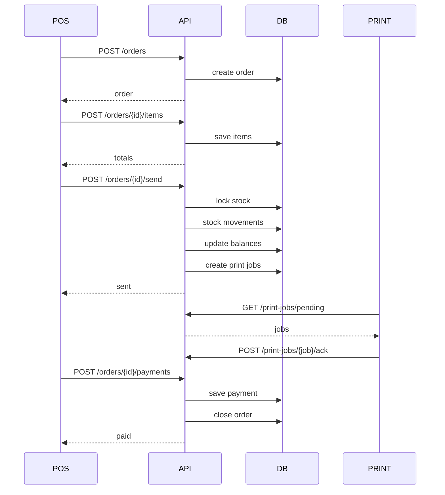
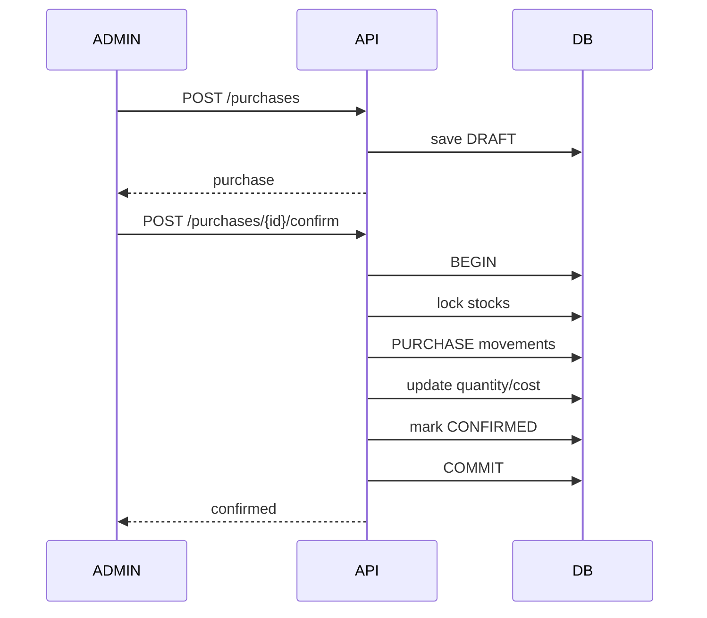

# API Contract — Sistema POS e Inventario para Cafetería

> Contrato REST v1 para frontend React/Vite/TypeScript y backend Laravel + MariaDB.

## 1. Objetivo

Este contrato define cómo se comunicarán las aplicaciones del sistema con la API: POS, administración, inventario, mesas, cocina, menú público, pantallas y futuros clientes móviles.

Principios:

- API versionada.
- Backend como autoridad de precios, permisos, stock y totales.
- Respuestas y errores uniformes.
- Cantidades y dinero enviados como strings decimales.
- Idempotencia en operaciones críticas.
- Auditoría de operaciones sensibles.
- Multi-sucursal desde el inicio.
- Ninguna venta, pago o movimiento de stock se elimina físicamente.

## 2. Base URLs

```text
Producción: https://api.cafeteria.com/api/v1
Pruebas:    https://api-demo.midominio.com/api/v1
Local:      http://localhost:8000/api/v1
```

Rutas públicas:

```text
/api/v1/public/*
```

Rutas privadas:

```text
/api/v1/*
```

## 3. Headers estándar

```http
Accept: application/json
Content-Type: application/json
Authorization: Bearer {token}
X-Branch-Id: 1
X-Request-Id: uuid
Idempotency-Key: uuid
```

`Idempotency-Key` será obligatorio en operaciones críticas como cobro, envío a preparación, confirmación de compra, cierre de caja y transferencias de inventario.

## 4. Autenticación

Tecnología recomendada:

```text
Laravel Sanctum
```

### POST /auth/login

```json
{
  "login": "ana",
  "password": "********"
}
```

Respuesta:

```json
{
  "success": true,
  "data": {
    "token": "token",
    "user": {
      "id": 8,
      "name": "Ana",
      "default_branch_id": 1,
      "roles": ["WAITER"],
      "permissions": ["sales.create","sales.send","tables.open"]
    }
  }
}
```

### POST /auth/pin

Cambio rápido de usuario en terminal POS.

```json
{
  "user_id": 8,
  "pin": "1234"
}
```

### GET /auth/me

Devuelve usuario, negocio, sucursal activa, roles y permisos.

### POST /auth/logout

```http
204 No Content
```

## 5. Respuesta estándar

Éxito:

```json
{
  "success": true,
  "data": {},
  "meta": {}
}
```

Error:

```json
{
  "success": false,
  "error": {
    "code": "INSUFFICIENT_STOCK",
    "message": "No hay suficiente leche.",
    "details": {}
  }
}
```

## 6. Códigos HTTP

```text
200 OK
201 Created
204 No Content
400 Bad Request
401 Unauthorized
403 Forbidden
404 Not Found
409 Conflict
422 Unprocessable Entity
429 Too Many Requests
500 Internal Server Error
503 Service Unavailable
```

## 7. Códigos de error funcionales

```text
VALIDATION_ERROR
UNAUTHENTICATED
FORBIDDEN
RESOURCE_NOT_FOUND
ORDER_ALREADY_PAID
ORDER_CANCELLED
ORDER_NOT_EDITABLE
ORDER_VERSION_CONFLICT
TABLE_OCCUPIED
TABLE_DISABLED
INSUFFICIENT_STOCK
INVENTORY_NOT_CONFIGURED
RECIPE_NOT_FOUND
INVALID_UNIT_CONVERSION
PURCHASE_ALREADY_CONFIRMED
CASH_SESSION_ALREADY_OPEN
CASH_SESSION_NOT_OPEN
IDEMPOTENCY_CONFLICT
```

## 8. Validación 422

```json
{
  "success": false,
  "error": {
    "code": "VALIDATION_ERROR",
    "message": "Los datos enviados no son válidos.",
    "details": {
      "fields": {
        "quantity": ["Debe ser mayor a cero."]
      }
    }
  }
}
```

## 9. Decimales

Dinero y cantidades se serializan como strings:

```json
{
  "price": "65.00",
  "quantity": "333.333333"
}
```

El frontend no debe usar `number` para matemática crítica.

TypeScript:

```ts
export type DecimalString = string;
```

## 10. Fechas

ISO 8601:

```text
2026-09-26T22:30:00-06:00
```

## 11. Paginación

```text
?page=1&per_page=25
```

Respuesta:

```json
{
  "meta": {
    "pagination": {
      "current_page": 1,
      "per_page": 25,
      "total": 200,
      "last_page": 8
    }
  }
}
```

Máximo recomendado:

```text
100 registros
```

## 12. Filtros y ordenamiento

```text
?q=latte
&status=OPEN
&branch_id=1
&from=2026-09-01
&to=2026-09-30
&sort=-created_at
```

## 13. Idempotencia

Ejemplo:

```http
Idempotency-Key: 550e8400-e29b-41d4-a716-446655440000
```

Misma clave + mismo request:

```text
devolver respuesta anterior
```

Misma clave + payload diferente:

```http
409 Conflict
```

```json
{
  "success": false,
  "error": {
    "code": "IDEMPOTENCY_CONFLICT",
    "message": "La clave ya fue utilizada con otra solicitud."
  }
}
```

## 14. Concurrencia de órdenes

Agregar a `orders`:

```sql
version BIGINT UNSIGNED NOT NULL DEFAULT 1
```

Toda modificación incrementa `version`.

Request:

```json
{
  "version": 7,
  "quantity": "2.000"
}
```

Si servidor está en versión 8:

```http
409 Conflict
```

```json
{
  "success": false,
  "error": {
    "code": "ORDER_VERSION_CONFLICT",
    "message": "La orden fue modificada desde otro dispositivo.",
    "details": {
      "current_version": 8
    }
  }
}
```

## 15. Health check

### GET /health

```json
{
  "success": true,
  "data": {
    "status": "ok",
    "database": "ok",
    "version": "1.0.0"
  }
}
```


# 16. Negocio, sucursales y configuración

## GET /business

Permiso:

```text
business.view
```

## PATCH /business

Permiso:

```text
business.update
```

```json
{
  "name": "Café Central",
  "timezone": "America/Mexico_City",
  "currency_code": "MXN"
}
```

## GET /branches
## POST /branches
## GET /branches/{branch}
## PATCH /branches/{branch}
## DELETE /branches/{branch}

`DELETE` realiza soft delete.

## GET /settings

Respuesta:

```json
{
  "success": true,
  "data": {
    "branding": {
      "primary_color": "#6F4E37",
      "secondary_color": "#D7B899",
      "accent_color": "#C98B4A",
      "logo_url": "https://cdn.example/logo.webp"
    },
    "features": {
      "inventory_enabled": true,
      "recipes_enabled": true,
      "tables_enabled": true,
      "waiters_enabled": true,
      "courtesies_enabled": true,
      "digital_menu_enabled": true
    },
    "operations": {
      "inventory_consumption_trigger": "ON_SEND",
      "negative_stock_enabled": false
    }
  }
}
```

## PATCH /settings

Permiso:

```text
settings.update
```

# 17. Usuarios, roles y permisos

## GET /users
## POST /users
## GET /users/{user}
## PATCH /users/{user}
## DELETE /users/{user}

Creación:

```json
{
  "name": "Ana Pérez",
  "username": "ana",
  "password": "StrongPassword123!",
  "default_branch_id": 1,
  "role_ids": [4]
}
```

## POST /users/{user}/reset-pin

Permiso:

```text
users.manage_pin
```

## GET /roles
## POST /roles
## GET /roles/{role}
## PATCH /roles/{role}
## DELETE /roles/{role}
## GET /permissions

## PUT /roles/{role}/permissions

```json
{
  "permission_ids": [1,2,5,8]
}
```

Los endpoints deben autorizar por permisos, no únicamente por nombre de rol.


# 18. Áreas y mesas

## GET /areas
## POST /areas
## PATCH /areas/{area}
## DELETE /areas/{area}

## GET /tables

Filtros:

```text
branch_id
area_id
status
```

Ejemplo:

```json
{
  "success": true,
  "data": [
    {
      "id": 5,
      "name": "Mesa 5",
      "status": "OCCUPIED",
      "capacity": 4,
      "active_order": {
        "id": 120,
        "order_number": "ORD-2026-000120",
        "version": 8,
        "waiter": {
          "id": 8,
          "name": "Ana"
        },
        "total": "425.00"
      }
    }
  ]
}
```

## POST /tables
## PATCH /tables/{table}
## DELETE /tables/{table}

## POST /tables/{table}/open

Permiso:

```text
tables.open
```

```json
{
  "waiter_id": 8,
  "customer_name": "Familia García"
}
```

Respuesta:

```json
{
  "success": true,
  "data": {
    "order_id": 120,
    "table_id": 5,
    "status": "OPEN",
    "version": 1
  }
}
```

## POST /tables/{table}/transfer

Permiso:

```text
tables.transfer
```

```json
{
  "to_waiter_id": 12,
  "reason": "Cambio de turno"
}
```

Si requiere autorización:

```json
{
  "to_waiter_id": 12,
  "reason": "Cambio de turno",
  "authorization_user_id": 2,
  "authorization_pin": "1234"
}
```

Nunca almacenar el PIN recibido.


# 19. Catálogo POS

## GET /pos/catalog

Debe devolver en una sola llamada los datos necesarios para iniciar el POS.

Query:

```text
branch_id=1
```

Respuesta conceptual:

```json
{
  "success": true,
  "data": {
    "catalog_version": 152,
    "categories": [],
    "products": [],
    "modifier_groups": [],
    "payment_methods": [],
    "settings": {
      "tables_enabled": true,
      "inventory_enabled": true
    }
  }
}
```

Puede utilizar:

```http
ETag: "catalog-v152"
```

# 20. Categorías

## GET /categories
## POST /categories
## GET /categories/{category}
## PATCH /categories/{category}
## DELETE /categories/{category}

# 21. Productos

## GET /products

Filtros:

```text
category_id
active
visible_pos
visible_web
visible_display
q
```

## POST /products

```json
{
  "category_id": 4,
  "sku": "LATTE",
  "name": "Latte",
  "description": "Espresso con leche",
  "inventory_policy": "RECIPE",
  "visible_pos": true,
  "visible_web": true,
  "visible_display": true
}
```

## GET /products/{product}
## PATCH /products/{product}
## DELETE /products/{product}

# 22. Variantes

## GET /products/{product}/variants
## POST /products/{product}/variants

```json
{
  "name": "Mediano",
  "sku": "LATTE-M",
  "price": "65.00",
  "inventory_policy": "RECIPE"
}
```

## PATCH /variants/{variant}
## DELETE /variants/{variant}

# 23. Modificadores

## GET /modifier-groups
## POST /modifier-groups

```json
{
  "name": "Tipo de leche",
  "min_select": 0,
  "max_select": 1,
  "required": false
}
```

## POST /modifier-groups/{group}/modifiers

```json
{
  "name": "Leche de almendra",
  "price_delta": "12.00"
}
```

## PUT /products/{product}/modifier-groups

```json
{
  "modifier_group_ids": [1,3,5]
}
```


# 24. Recetas

## GET /variants/{variant}/recipe

```json
{
  "success": true,
  "data": {
    "id": 30,
    "name": "Latte mediano",
    "items": [
      {
        "inventory_item_id": 15,
        "name": "Leche entera",
        "quantity": "333.333333",
        "unit": "ml"
      },
      {
        "inventory_item_id": 20,
        "name": "Café",
        "quantity": "18.000000",
        "unit": "g"
      }
    ]
  }
}
```

## PUT /variants/{variant}/recipe

Permiso:

```text
recipes.manage
```

```json
{
  "name": "Latte mediano",
  "items": [
    {
      "inventory_item_id": 15,
      "quantity": "333.333333"
    },
    {
      "inventory_item_id": 20,
      "quantity": "18.000000"
    }
  ]
}
```

# 25. Reglas de inventario de modificadores

## GET /modifiers/{modifier}/inventory-rules
## PUT /modifiers/{modifier}/inventory-rules

Ejemplo sustitución:

```json
{
  "rules": [
    {
      "action": "REMOVE",
      "target_inventory_item_id": 15
    },
    {
      "action": "ADD",
      "target_inventory_item_id": 22,
      "quantity": "333.333333"
    }
  ]
}
```

Acciones válidas:

```text
ADD
REMOVE
REPLACE
MULTIPLY
```


# 26. Inventario

## GET /inventory

Permiso:

```text
inventory.view
```

Filtros:

```text
branch_id
warehouse_id
low_stock
active
q
```

```json
{
  "success": true,
  "data": [
    {
      "id": 15,
      "sku": "LECHE-ENT",
      "name": "Leche entera",
      "base_unit": {
        "code": "ml",
        "name": "Mililitro"
      },
      "stock": {
        "warehouse_id": 2,
        "quantity": "119000.000000",
        "display": "119 L"
      },
      "minimum_stock": "12000.000000"
    }
  ]
}
```

Con `inventory.view_cost`:

```json
{
  "average_cost": "0.025000",
  "inventory_value": "2975.00"
}
```

## POST /inventory

```json
{
  "sku": "LECHE-ENT",
  "name": "Leche entera",
  "base_unit_id": 1,
  "minimum_stock": "12000.000000",
  "track_inventory": true
}
```

## GET /inventory/{item}
## PATCH /inventory/{item}
## DELETE /inventory/{item}

No permitir cambiar unidad base si ya existen movimientos, excepto mediante proceso especial.

# 27. Presentaciones

## GET /inventory/{item}/presentations
## POST /inventory/{item}/presentations

```json
{
  "name": "Caja 12 x 1 L",
  "code": "BOX-12",
  "factor_to_base": "12000.000000",
  "purchase_unit_label": "caja",
  "default_purchase": true
}
```

## PATCH /inventory-presentations/{presentation}

# 28. Movimientos

## GET /inventory/{item}/movements

Filtros:

```text
warehouse_id
movement_type
from
to
reference_type
```

```json
{
  "success": true,
  "data": [
    {
      "id": 9001,
      "movement_type": "SALE",
      "quantity": "-333.333333",
      "unit_cost": "0.025000",
      "reference_type": "ORDER_ITEM",
      "reference_id": 8142,
      "occurred_at": "2026-09-26T20:10:00-06:00"
    }
  ]
}
```

# 29. Ajuste

## POST /inventory/{item}/adjust

Permiso:

```text
inventory.adjust
```

```json
{
  "warehouse_id": 2,
  "quantity": "-3.000000",
  "reason": "Diferencia en conteo físico"
}
```

# 30. Merma

## POST /inventory/waste

```json
{
  "warehouse_id": 2,
  "inventory_item_id": 15,
  "quantity": "500.000000",
  "reason": "Leche derramada",
  "order_id": null,
  "order_item_id": null
}
```

Backend genera:

```text
WASTE -500
```

# 31. Transferencias

## POST /inventory/transfers

Header obligatorio:

```text
Idempotency-Key
```

```json
{
  "from_warehouse_id": 1,
  "to_warehouse_id": 2,
  "items": [
    {
      "inventory_item_id": 15,
      "quantity": "3000.000000"
    }
  ],
  "notes": "Reposición de barra"
}
```

# 32. Almacenes

## GET /warehouses
## POST /warehouses
## PATCH /warehouses/{warehouse}


# 33. Órdenes

## GET /orders

Filtros:

```text
branch_id
status
table_id
waiter_id
from
to
q
```

## POST /orders

Permiso:

```text
sales.create
```

Mostrador:

```json
{
  "branch_id": 1,
  "order_type": "TAKEAWAY",
  "waiter_id": 8,
  "customer_name": "Evelyn"
}
```

Mesa:

```json
{
  "branch_id": 1,
  "order_type": "DINE_IN",
  "table_id": 5,
  "waiter_id": 8
}
```

## GET /orders/{order}

```json
{
  "success": true,
  "data": {
    "id": 120,
    "order_number": "ORD-2026-000120",
    "version": 8,
    "status": "OPEN",
    "table": {
      "id": 5,
      "name": "Mesa 5"
    },
    "waiter": {
      "id": 8,
      "name": "Ana"
    },
    "items": [],
    "totals": {
      "subtotal": "120.00",
      "discount_total": "0.00",
      "courtesy_total": "0.00",
      "tax_total": "0.00",
      "total": "120.00",
      "paid_total": "0.00",
      "balance": "120.00"
    }
  }
}
```

# 34. Agregar producto

## POST /orders/{order}/items

```json
{
  "version": 8,
  "product_variant_id": 30,
  "quantity": "2.000",
  "modifier_ids": [5,9],
  "notes": "Sin canela"
}
```

Backend recalcula el precio.

# 35. Modificar producto

## PATCH /orders/{order}/items/{item}

```json
{
  "version": 9,
  "quantity": "3.000",
  "modifier_ids": [5],
  "notes": "Extra caliente"
}
```

Si ya hubo consumo de inventario, se aplican deltas.

# 36. Retirar producto antes de envío

## DELETE /orders/{order}/items/{item}

Solo si aún no fue enviado/preparado.

# 37. Cancelar producto enviado

## POST /orders/{order}/items/{item}/cancel

Permiso:

```text
sales.cancel
```

```json
{
  "version": 10,
  "quantity": "1.000",
  "reason": "Cliente cambió pedido",
  "inventory_action": "WASTE"
}
```

Valores:

```text
RETURN_TO_STOCK
WASTE
NO_ACTION
```

# 38. Enviar a preparación

## POST /orders/{order}/send

Headers:

```text
Idempotency-Key
```

Permiso:

```text
sales.send
```

```json
{
  "version": 11,
  "item_ids": [8142,8143]
}
```

Si `item_ids` se omite, envía todos los pendientes.

La operación debe ser transaccional:

```text
1 validar orden
2 resolver recetas
3 resolver modificadores
4 bloquear stock
5 validar existencia
6 crear stock_movements
7 actualizar warehouse_stock
8 marcar inventory_consumed
9 actualizar estados
10 generar comandas
11 incrementar version
12 commit
```

Respuesta:

```json
{
  "success": true,
  "data": {
    "order_id": 120,
    "version": 12,
    "status": "SENT",
    "inventory_movements_created": 7,
    "print_jobs_created": 2
  }
}
```

# 39. Precuenta

## POST /orders/{order}/precheck

No cierra la orden.

# 40. Transferir orden

## POST /orders/{order}/transfer

```json
{
  "version": 12,
  "to_waiter_id": 12,
  "reason": "Cambio de turno"
}
```


# 41. Descuentos

## POST /orders/{order}/discounts

Permiso:

```text
sales.discount
```

Porcentaje:

```json
{
  "version": 13,
  "discount_type": "PERCENTAGE",
  "value": "10.0000",
  "reason": "Promoción"
}
```

Por artículo:

```json
{
  "version": 13,
  "order_item_id": 8142,
  "discount_type": "AMOUNT",
  "value": "20.00",
  "reason": "Promoción"
}
```

# 42. Cortesías

## POST /orders/{order}/courtesies

Permiso:

```text
sales.courtesy
```

```json
{
  "version": 14,
  "order_item_id": null,
  "amount": "420.00",
  "reason": "Invitación familiar"
}
```

La cortesía modifica lo cobrado, nunca devuelve automáticamente ingredientes al inventario.

# 43. Pagos

## POST /orders/{order}/payments

Header obligatorio:

```text
Idempotency-Key
```

```json
{
  "version": 15,
  "payments": [
    {
      "payment_method_id": 1,
      "amount": "200.00"
    },
    {
      "payment_method_id": 2,
      "amount": "300.00",
      "reference": "TERM-12345"
    }
  ]
}
```

Respuesta:

```json
{
  "success": true,
  "data": {
    "order_id": 120,
    "version": 16,
    "paid_total": "500.00",
    "balance": "0.00",
    "status": "PAID"
  }
}
```

Si queda saldo:

```text
PARTIALLY_PAID
```

# 44. Anular pago

## POST /payments/{payment}/void

Permiso:

```text
payments.void
```

# 45. Reembolso

## POST /payments/{payment}/refund

Permiso:

```text
payments.refund
```

Header:

```text
Idempotency-Key
```

# 46. Cancelar orden completa

## POST /orders/{order}/cancel

```json
{
  "version": 16,
  "reason": "Orden duplicada",
  "inventory_action": "WASTE"
}
```

# 47. Cocina/KDS

## POST /order-items/{item}/kitchen-status

```json
{
  "status": "PREPARING"
}
```

Estados:

```text
PENDING
PREPARING
READY
SERVED
CANCELLED
```


# 48. Proveedores

## GET /suppliers
## POST /suppliers
## GET /suppliers/{supplier}
## PATCH /suppliers/{supplier}
## DELETE /suppliers/{supplier}

# 49. Compras

## GET /purchases

Filtros:

```text
supplier_id
status
from
to
branch_id
```

## POST /purchases

```json
{
  "branch_id": 1,
  "warehouse_id": 2,
  "supplier_id": 5,
  "purchase_date": "2026-09-26",
  "invoice_number": "A-1023",
  "items": [
    {
      "inventory_item_id": 15,
      "inventory_presentation_id": 7,
      "quantity": "10.000000",
      "unit_price": "300.00"
    }
  ]
}
```

Backend calcula:

```text
factor_to_base
base_quantity
subtotal
tax
total
```

## GET /purchases/{purchase}
## PATCH /purchases/{purchase}

Solo `DRAFT`.

## POST /purchases/{purchase}/confirm

Header:

```text
Idempotency-Key
```

Permiso:

```text
purchases.confirm
```

La operación:

```text
genera PURCHASE stock movements
actualiza warehouse_stock
recalcula average_cost
marca CONFIRMED
```

## POST /purchases/{purchase}/cancel

Permiso:

```text
purchases.cancel
```

Debe generar movimientos inversos, no eliminar los originales.


# 50. Caja

## GET /cash-registers
## POST /cash-registers

## POST /cash-registers/{register}/open

```json
{
  "opening_amount": "1000.00"
}
```

Error 409 si existe sesión abierta.

## GET /cash-registers/{register}/current-session

## POST /cash-sessions/{session}/movements

```json
{
  "movement_type": "WITHDRAWAL",
  "amount": "500.00",
  "description": "Retiro parcial"
}
```

Tipos:

```text
OPENING
SALE
DEPOSIT
WITHDRAWAL
EXPENSE
REFUND
ADJUSTMENT
```

## GET /cash-sessions/{session}/summary

```json
{
  "success": true,
  "data": {
    "opening_amount": "1000.00",
    "cash_sales": "6500.00",
    "withdrawals": "2000.00",
    "expenses": "300.00",
    "expected_amount": "5200.00"
  }
}
```

## POST /cash-sessions/{session}/close

Header:

```text
Idempotency-Key
```

```json
{
  "counted_amount": "5150.00",
  "notes": "Faltante de $50"
}
```

Respuesta:

```json
{
  "success": true,
  "data": {
    "expected_amount": "5200.00",
    "counted_amount": "5150.00",
    "difference_amount": "-50.00",
    "status": "CLOSED"
  }
}
```

# 51. Gastos

## GET /expenses
## POST /expenses

```json
{
  "branch_id": 1,
  "expense_category_id": 3,
  "amount": "850.00",
  "expense_date": "2026-09-26",
  "description": "Material de limpieza",
  "payment_method_id": 1,
  "cash_session_id": 55
}
```

## PATCH /expenses/{expense}
## DELETE /expenses/{expense}

Para gastos conciliados, preferir void/reversa.

## GET /expense-categories
## POST /expense-categories
## PATCH /expense-categories/{category}

# 52. Métodos de pago

## GET /payment-methods
## POST /payment-methods
## PATCH /payment-methods/{method}


# 53. Reportes y KPIs

## GET /reports/dashboard

Permiso:

```text
reports.view
```

Filtros:

```text
branch_id
from
to
```

```json
{
  "success": true,
  "data": {
    "sales": {
      "gross": "18540.00",
      "net": "17200.00",
      "orders": 75,
      "average_ticket": "229.33"
    },
    "discounts": "540.00",
    "courtesies": "800.00",
    "expenses": "2300.00",
    "inventory_cost": "6120.00",
    "gross_profit": "11080.00"
  }
}
```

## GET /reports/sales

Filtros:

```text
from
to
branch_id
group_by=hour|day|month
```

## GET /reports/products

## GET /reports/waiters

Métricas posibles:

```text
ventas
órdenes
ticket promedio
descuentos
cortesías
cancelaciones
```

## GET /reports/inventory
## GET /reports/purchases
## GET /reports/expenses

# 54. Auditoría

## GET /audit-logs

Permiso:

```text
audit.view
```

Filtros:

```text
user_id
action
entity_type
entity_id
from
to
```


# 55. Menú público

## GET /public/menu

Sin autenticación.

```json
{
  "success": true,
  "data": {
    "business": {
      "name": "Café Central",
      "logo_url": "https://..."
    },
    "categories": [
      {
        "id": 1,
        "name": "Cafés",
        "products": []
      }
    ]
  }
}
```

Nunca devolver:

```text
average_cost
inventory_value
cantidad interna exacta
```

## GET /public/menu/products/{slug}

Puede devolver:

```text
available: true|false
```

# 56. Pantallas digitales

## GET /public/displays/{code}

```json
{
  "success": true,
  "data": {
    "name": "Pantalla Barra",
    "layout_type": "GRID",
    "refresh_seconds": 60,
    "items": []
  }
}
```

Administración:

```text
GET  /displays
POST /displays
PATCH /displays/{display}
PUT /displays/{display}/items
```


# 57. Impresión

## GET /printers
## POST /printers
## PATCH /printers/{printer}

## POST /orders/{order}/print-ticket

```json
{
  "success": true,
  "data": {
    "print_job_id": 981
  }
}
```

## POST /orders/{order}/print-kitchen

# 58. Print Agent

El agente local puede consultar:

## GET /print-jobs/pending?printer_id=1

Confirmación:

## POST /print-jobs/{job}/ack

Éxito:

```json
{
  "status": "PRINTED"
}
```

Error:

```json
{
  "status": "FAILED",
  "error": "Printer offline"
}
```


# 59. Uploads

## POST /uploads/images

```text
multipart/form-data
```

Respuesta:

```json
{
  "success": true,
  "data": {
    "path": "products/abc.webp",
    "url": "https://..."
  }
}
```

Validar MIME, tamaño y dimensiones.

# 60. CORS

Permitir únicamente orígenes conocidos:

```text
https://cafeteria.vercel.app
https://www.cafeteria.com
https://pos.cafeteria.com
```

No utilizar `*` para endpoints autenticados.

# 61. Rate limiting

Login:

```text
5-10 intentos/minuto por IP/usuario
```

API autenticada:

```text
límite configurable
```

Menú público:

```text
cache + límite amplio
```

# 62. Cache

Menú:

```http
Cache-Control: public, max-age=60
```

Catálogo POS:

```text
ETag
```

Órdenes y stock:

```http
Cache-Control: no-store
```

# 63. Request ID

Si el cliente no manda:

```http
X-Request-Id
```

el backend genera UUID.

Debe incluirse en logs y en la respuesta.

# 64. Seguridad de logs

Nunca registrar:

```text
password
PIN
Authorization header
CVV
número completo de tarjeta
```

Sí:

```text
request_id
user_id
route
status
duration_ms
```


# 65. Permisos base

```text
business.view
business.update

users.view
users.create
users.update
users.delete
users.manage_pin

roles.view
roles.manage

products.view
products.manage
recipes.manage

sales.create
sales.send
sales.discount
sales.courtesy
sales.cancel
sales.pay

tables.view
tables.open
tables.transfer

inventory.view
inventory.view_cost
inventory.adjust
inventory.waste
inventory.transfer

purchases.view
purchases.create
purchases.confirm
purchases.cancel

cash.view
cash.open
cash.move
cash.close

expenses.view
expenses.manage

reports.view

settings.view
settings.update

audit.view

print.ticket
print.kitchen

payments.void
payments.refund
```

# 66. Autorización por PIN

Acciones sensibles pueden requerir autorizador:

```json
{
  "authorization_user_id": 2,
  "authorization_pin": "1234"
}
```

Usos:

```text
descuento superior al límite
cortesía
cancelación de producto preparado
stock negativo
ajuste de caja
```

Backend valida el permiso del autorizador.

# 67. Conflicto de stock

```http
409 Conflict
```

```json
{
  "success": false,
  "error": {
    "code": "INSUFFICIENT_STOCK",
    "message": "Stock insuficiente.",
    "details": {
      "items": [
        {
          "inventory_item_id": 15,
          "name": "Leche entera",
          "required": "333.333333",
          "available": "200.000000",
          "unit": "ml"
        }
      ]
    }
  }
}
```

# 68. Mesa ocupada

```json
{
  "success": false,
  "error": {
    "code": "TABLE_OCCUPIED",
    "message": "La mesa ya tiene una cuenta abierta.",
    "details": {
      "order_id": 120
    }
  }
}
```


# 69. Laravel: estructura recomendada

Form Requests:

```text
LoginRequest
StoreOrderRequest
AddOrderItemRequest
UpdateOrderItemRequest
SendOrderRequest
PayOrderRequest
ApplyDiscountRequest
ApplyCourtesyRequest
CancelOrderItemRequest
AdjustInventoryRequest
TransferInventoryRequest
ConfirmPurchaseRequest
CloseCashSessionRequest
```

Resources:

```text
UserResource
TableResource
ProductResource
OrderResource
OrderItemResource
InventoryResource
PurchaseResource
CashSessionResource
DashboardResource
```

Policies:

```text
OrderPolicy
InventoryPolicy
PurchasePolicy
CashSessionPolicy
UserPolicy
SettingsPolicy
```

# 70. Grupo de rutas conceptual

```php
Route::prefix('v1')->group(function () {

    Route::prefix('public')->group(function () {
        // menu
        // displays
    });

    Route::middleware('auth:sanctum')->group(function () {
        // POS
        // orders
        // inventory
        // purchases
        // cash
        // reports
    });
});
```

# 71. Frontend TypeScript

```ts
export interface ApiSuccess<T> {
  success: true;
  data: T;
  meta?: Record<string, unknown>;
}

export interface ApiFailure {
  success: false;
  error: {
    code: string;
    message: string;
    details?: unknown;
  };
}
```

# 72. Flujo POS



# 73. Flujo compra



# 74. Operaciones que obligatoriamente usan DB transaction

```text
send order
payment
purchase confirmation
purchase reversal
inventory transfer
inventory adjustment
waste
cash closing
refund
```

# 75. Reglas de DELETE

DELETE se permite en catálogos con soft delete.

Nunca eliminar físicamente:

```text
paid orders
payments
stock_movements
confirmed purchases
cash_movements
audit_logs
```

Usar:

```text
cancel
void
refund
reverse
```

# 76. MVP de API

```text
POST /auth/login
GET  /auth/me

GET  /pos/catalog

GET  /tables
POST /tables/{table}/open
POST /tables/{table}/transfer

POST /orders
GET  /orders/{order}
POST /orders/{order}/items
PATCH /orders/{order}/items/{item}
POST /orders/{order}/send
POST /orders/{order}/payments
POST /orders/{order}/discounts
POST /orders/{order}/courtesies
POST /orders/{order}/cancel

GET  /inventory
POST /inventory/{item}/adjust
POST /inventory/waste

GET  /purchases
POST /purchases
POST /purchases/{purchase}/confirm

POST /cash-registers/{register}/open
GET  /cash-sessions/{session}/summary
POST /cash-sessions/{session}/close

GET  /reports/dashboard

GET  /public/menu
GET  /public/displays/{code}
```

# 77. Orden recomendado de implementación

```text
1 Auth
2 Business/branch context
3 Permissions
4 Catalog
5 Tables
6 Orders
7 Order items
8 Inventory
9 Recipes
10 Send order
11 Payments
12 Cash
13 Discounts/courtesies
14 Cancellations
15 Purchases
16 Expenses
17 Reports
18 Public menu
19 Displays
20 Printing
21 Audit
```

# 78. OpenAPI

Este documento deberá convertirse después a:

```text
openapi.yaml
```

OpenAPI 3.1 permitirá:

- Swagger UI;
- generación de tipos TypeScript;
- clientes HTTP tipados;
- pruebas de contrato;
- documentación interactiva;
- validación automática de requests/responses.

# 79. Criterio de aceptación

El contrato estará correctamente implementado cuando pueda completarse este escenario exclusivamente mediante la API:

```text
1 iniciar sesión
2 obtener catálogo
3 abrir mesa
4 agregar 3 cafés
5 enviar orden
6 descontar recetas
7 transferir mesa a otro mesero
8 aplicar descuento o cortesía
9 dividir pago
10 cerrar orden
11 generar ticket
12 liberar mesa
13 consultar nuevo stock
14 consultar caja
15 consultar dashboard
16 consultar auditoría
```
