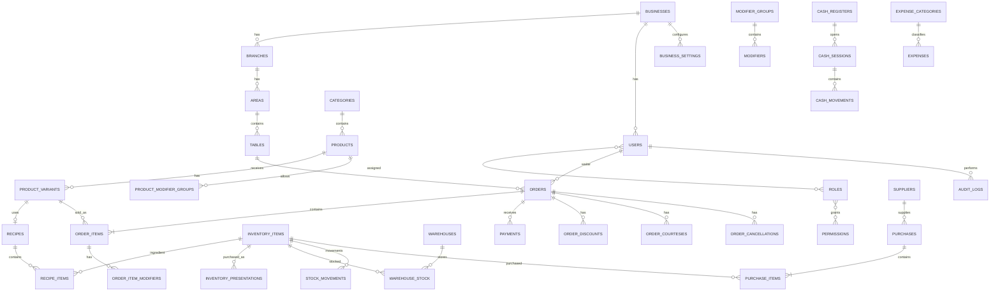
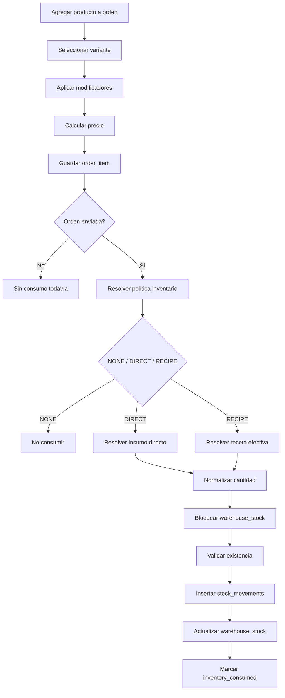
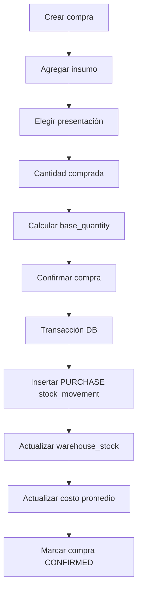
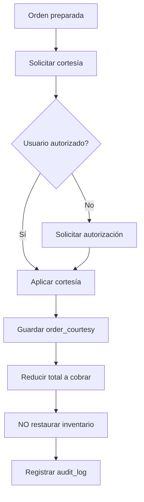
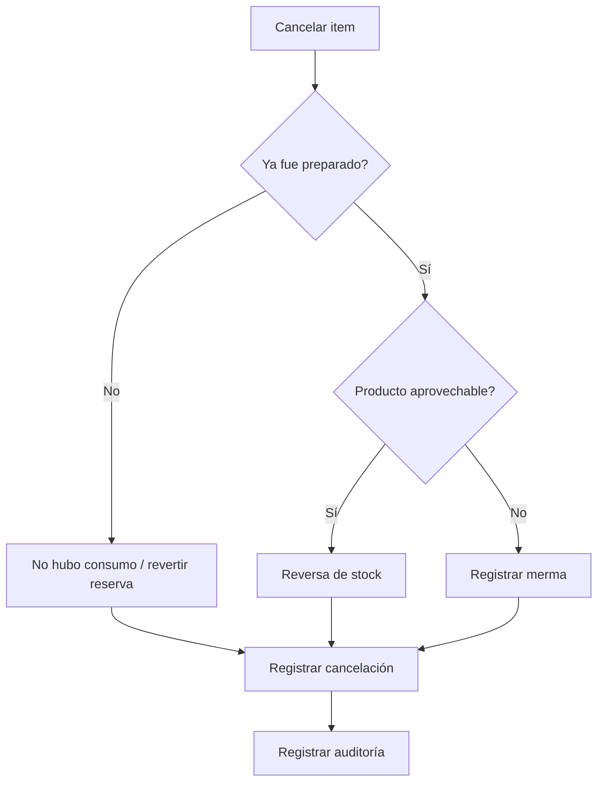

# Database Schema — Sistema POS e Inventario para Cafetería

> Esquema de base de datos propuesto para un sistema POS modular de cafetería con ventas por mesa, inventario tradicional y por receta, compras, gastos, caja, descuentos, cortesías, menús digitales, auditoría y soporte futuro para multi-sucursal.

---

# 1. Objetivos del esquema

Este modelo está diseñado para:

- soportar ventas de mostrador y por mesa;
- permitir múltiples sucursales;
- manejar productos simples, variantes y modificadores;
- manejar inventario por pieza, lata, botella, paquete, caja, ml, L, g, kg, etc.;
- convertir presentaciones de compra a una unidad base;
- descontar inventario de forma directa o mediante receta;
- manejar recetas opcionales por producto o variante;
- registrar compras, gastos, mermas y ajustes;
- mantener trazabilidad completa mediante movimientos de inventario;
- gestionar cajas, sesiones y movimientos de efectivo;
- manejar descuentos, cortesías y cancelaciones;
- conservar historial de cambios;
- soportar roles y permisos;
- generar KPIs sin depender de datos calculados exclusivamente en frontend;
- permitir personalización por negocio;
- permitir despliegue en MariaDB sobre cPanel.

---

# 2. Convenciones generales

## 2.1 Motor

```text
MariaDB 10.6+
InnoDB
utf8mb4
utf8mb4_unicode_ci
```

---

## 2.2 Convenciones de nombres

Tablas:

```text
snake_case
plural
```

Ejemplo:

```text
inventory_items
stock_movements
order_items
```

Claves primarias:

```text
id BIGINT UNSIGNED AUTO_INCREMENT
```

Claves foráneas:

```text
<entity>_id
```

Ejemplo:

```text
business_id
branch_id
order_id
```

---

## 2.3 Campos estándar

Cuando aplique:

```sql
created_at DATETIME NULL
updated_at DATETIME NULL
deleted_at DATETIME NULL
```

Se recomienda Soft Delete solamente en catálogos y configuración.

No usar Soft Delete en:

```text
orders
payments
stock_movements
cash_movements
audit_logs
```

porque son registros transaccionales.

---

# 3. Tipos de datos recomendados

## Dinero

```sql
DECIMAL(12,2)
```

Para negocios medianos será suficiente.

Ejemplos:

```text
price
subtotal
tax
discount
total
cost
```

---

## Cantidades de inventario

```sql
DECIMAL(18,6)
```

Permite:

```text
333.333333 ml
18.000000 g
0.250000 kg
```

---

## Porcentajes

```sql
DECIMAL(8,4)
```

Ejemplo:

```text
16.0000
10.5000
```

---

## Booleanos

```sql
TINYINT(1)
```

---

## Estados

Preferir:

```text
VARCHAR + validación en aplicación
```

en lugar de ENUM de MariaDB para facilitar evolución.

Ejemplo:

```sql
status VARCHAR(30)
```

y validarlo en Laravel con Enums PHP.

---

# 4. Relación general



---

# 5. Negocio y sucursales

## 5.1 businesses

Representa al cliente o empresa.

```sql
CREATE TABLE businesses (
    id BIGINT UNSIGNED AUTO_INCREMENT PRIMARY KEY,
    name VARCHAR(150) NOT NULL,
    legal_name VARCHAR(200) NULL,
    tax_id VARCHAR(30) NULL,
    phone VARCHAR(30) NULL,
    email VARCHAR(150) NULL,
    timezone VARCHAR(60) NOT NULL DEFAULT 'America/Mexico_City',
    currency_code CHAR(3) NOT NULL DEFAULT 'MXN',
    active TINYINT(1) NOT NULL DEFAULT 1,
    created_at DATETIME NULL,
    updated_at DATETIME NULL,
    deleted_at DATETIME NULL,

    INDEX idx_businesses_active (active)
) ENGINE=InnoDB DEFAULT CHARSET=utf8mb4 COLLATE=utf8mb4_unicode_ci;
```

---

## 5.2 branches

```sql
CREATE TABLE branches (
    id BIGINT UNSIGNED AUTO_INCREMENT PRIMARY KEY,
    business_id BIGINT UNSIGNED NOT NULL,
    name VARCHAR(150) NOT NULL,
    code VARCHAR(30) NOT NULL,
    phone VARCHAR(30) NULL,
    email VARCHAR(150) NULL,
    address_line1 VARCHAR(200) NULL,
    address_line2 VARCHAR(200) NULL,
    city VARCHAR(100) NULL,
    state VARCHAR(100) NULL,
    postal_code VARCHAR(20) NULL,
    country_code CHAR(2) NOT NULL DEFAULT 'MX',
    active TINYINT(1) NOT NULL DEFAULT 1,
    created_at DATETIME NULL,
    updated_at DATETIME NULL,
    deleted_at DATETIME NULL,

    CONSTRAINT fk_branches_business
        FOREIGN KEY (business_id) REFERENCES businesses(id),

    UNIQUE KEY uq_branch_code (business_id, code),
    INDEX idx_branches_business_active (business_id, active)
);
```

---

# 6. Configuración del negocio

## 6.1 business_settings

```sql
CREATE TABLE business_settings (
    id BIGINT UNSIGNED AUTO_INCREMENT PRIMARY KEY,
    business_id BIGINT UNSIGNED NOT NULL,

    logo_path VARCHAR(255) NULL,
    favicon_path VARCHAR(255) NULL,
    ticket_logo_path VARCHAR(255) NULL,

    primary_color VARCHAR(20) NULL,
    secondary_color VARCHAR(20) NULL,
    accent_color VARCHAR(20) NULL,
    background_color VARCHAR(20) NULL,

    font_family VARCHAR(100) NULL,
    border_radius VARCHAR(20) NULL,
    dark_mode TINYINT(1) NOT NULL DEFAULT 0,

    inventory_enabled TINYINT(1) NOT NULL DEFAULT 1,
    recipes_enabled TINYINT(1) NOT NULL DEFAULT 1,
    tables_enabled TINYINT(1) NOT NULL DEFAULT 1,
    waiters_enabled TINYINT(1) NOT NULL DEFAULT 1,
    kitchen_enabled TINYINT(1) NOT NULL DEFAULT 0,
    purchases_enabled TINYINT(1) NOT NULL DEFAULT 1,
    expenses_enabled TINYINT(1) NOT NULL DEFAULT 1,
    digital_menu_enabled TINYINT(1) NOT NULL DEFAULT 1,
    displays_enabled TINYINT(1) NOT NULL DEFAULT 1,
    cash_register_enabled TINYINT(1) NOT NULL DEFAULT 1,
    discounts_enabled TINYINT(1) NOT NULL DEFAULT 1,
    courtesies_enabled TINYINT(1) NOT NULL DEFAULT 1,
    negative_stock_enabled TINYINT(1) NOT NULL DEFAULT 0,

    created_at DATETIME NULL,
    updated_at DATETIME NULL,

    CONSTRAINT fk_business_settings_business
        FOREIGN KEY (business_id) REFERENCES businesses(id),

    UNIQUE KEY uq_business_settings_business (business_id)
);
```

---

# 7. Usuarios, roles y permisos

## 7.1 users

```sql
CREATE TABLE users (
    id BIGINT UNSIGNED AUTO_INCREMENT PRIMARY KEY,
    business_id BIGINT UNSIGNED NOT NULL,
    default_branch_id BIGINT UNSIGNED NULL,

    name VARCHAR(150) NOT NULL,
    email VARCHAR(150) NULL,
    username VARCHAR(80) NULL,
    password VARCHAR(255) NOT NULL,
    pin_hash VARCHAR(255) NULL,

    active TINYINT(1) NOT NULL DEFAULT 1,
    last_login_at DATETIME NULL,

    remember_token VARCHAR(100) NULL,
    created_at DATETIME NULL,
    updated_at DATETIME NULL,
    deleted_at DATETIME NULL,

    CONSTRAINT fk_users_business
        FOREIGN KEY (business_id) REFERENCES businesses(id),

    CONSTRAINT fk_users_default_branch
        FOREIGN KEY (default_branch_id) REFERENCES branches(id),

    UNIQUE KEY uq_users_business_email (business_id, email),
    UNIQUE KEY uq_users_business_username (business_id, username),
    INDEX idx_users_business_active (business_id, active)
);
```

---

## 7.2 roles

```sql
CREATE TABLE roles (
    id BIGINT UNSIGNED AUTO_INCREMENT PRIMARY KEY,
    business_id BIGINT UNSIGNED NULL,
    name VARCHAR(80) NOT NULL,
    code VARCHAR(80) NOT NULL,
    system_role TINYINT(1) NOT NULL DEFAULT 0,
    created_at DATETIME NULL,
    updated_at DATETIME NULL,

    CONSTRAINT fk_roles_business
        FOREIGN KEY (business_id) REFERENCES businesses(id),

    UNIQUE KEY uq_roles_business_code (business_id, code)
);
```

---

## 7.3 permissions

```sql
CREATE TABLE permissions (
    id BIGINT UNSIGNED AUTO_INCREMENT PRIMARY KEY,
    code VARCHAR(120) NOT NULL,
    name VARCHAR(150) NOT NULL,
    description VARCHAR(255) NULL,

    UNIQUE KEY uq_permissions_code (code)
);
```

---

## 7.4 role_user

```sql
CREATE TABLE role_user (
    user_id BIGINT UNSIGNED NOT NULL,
    role_id BIGINT UNSIGNED NOT NULL,

    PRIMARY KEY (user_id, role_id),

    CONSTRAINT fk_role_user_user
        FOREIGN KEY (user_id) REFERENCES users(id) ON DELETE CASCADE,

    CONSTRAINT fk_role_user_role
        FOREIGN KEY (role_id) REFERENCES roles(id) ON DELETE CASCADE
);
```

---

## 7.5 permission_role

```sql
CREATE TABLE permission_role (
    permission_id BIGINT UNSIGNED NOT NULL,
    role_id BIGINT UNSIGNED NOT NULL,

    PRIMARY KEY (permission_id, role_id),

    CONSTRAINT fk_permission_role_permission
        FOREIGN KEY (permission_id) REFERENCES permissions(id) ON DELETE CASCADE,

    CONSTRAINT fk_permission_role_role
        FOREIGN KEY (role_id) REFERENCES roles(id) ON DELETE CASCADE
);
```

---

# 8. Áreas y mesas

## 8.1 areas

```sql
CREATE TABLE areas (
    id BIGINT UNSIGNED AUTO_INCREMENT PRIMARY KEY,
    branch_id BIGINT UNSIGNED NOT NULL,
    name VARCHAR(100) NOT NULL,
    sort_order INT NOT NULL DEFAULT 0,
    active TINYINT(1) NOT NULL DEFAULT 1,
    created_at DATETIME NULL,
    updated_at DATETIME NULL,

    CONSTRAINT fk_areas_branch
        FOREIGN KEY (branch_id) REFERENCES branches(id),

    INDEX idx_areas_branch (branch_id)
);
```

---

## 8.2 tables

```sql
CREATE TABLE tables (
    id BIGINT UNSIGNED AUTO_INCREMENT PRIMARY KEY,
    branch_id BIGINT UNSIGNED NOT NULL,
    area_id BIGINT UNSIGNED NULL,

    name VARCHAR(80) NOT NULL,
    code VARCHAR(30) NULL,
    capacity SMALLINT UNSIGNED NULL,
    status VARCHAR(30) NOT NULL DEFAULT 'AVAILABLE',

    x_position DECIMAL(10,2) NULL,
    y_position DECIMAL(10,2) NULL,

    active TINYINT(1) NOT NULL DEFAULT 1,
    created_at DATETIME NULL,
    updated_at DATETIME NULL,
    deleted_at DATETIME NULL,

    CONSTRAINT fk_tables_branch
        FOREIGN KEY (branch_id) REFERENCES branches(id),

    CONSTRAINT fk_tables_area
        FOREIGN KEY (area_id) REFERENCES areas(id),

    UNIQUE KEY uq_tables_branch_name (branch_id, name),
    INDEX idx_tables_branch_status (branch_id, status)
);
```

---

# 9. Categorías, productos y variantes

## 9.1 categories

```sql
CREATE TABLE categories (
    id BIGINT UNSIGNED AUTO_INCREMENT PRIMARY KEY,
    business_id BIGINT UNSIGNED NOT NULL,
    parent_id BIGINT UNSIGNED NULL,

    name VARCHAR(120) NOT NULL,
    slug VARCHAR(150) NOT NULL,
    image_path VARCHAR(255) NULL,
    sort_order INT NOT NULL DEFAULT 0,

    visible_pos TINYINT(1) NOT NULL DEFAULT 1,
    visible_web TINYINT(1) NOT NULL DEFAULT 1,
    visible_display TINYINT(1) NOT NULL DEFAULT 1,
    active TINYINT(1) NOT NULL DEFAULT 1,

    created_at DATETIME NULL,
    updated_at DATETIME NULL,
    deleted_at DATETIME NULL,

    CONSTRAINT fk_categories_business
        FOREIGN KEY (business_id) REFERENCES businesses(id),

    CONSTRAINT fk_categories_parent
        FOREIGN KEY (parent_id) REFERENCES categories(id),

    UNIQUE KEY uq_categories_business_slug (business_id, slug),
    INDEX idx_categories_business_active (business_id, active)
);
```

---

## 9.2 products

```sql
CREATE TABLE products (
    id BIGINT UNSIGNED AUTO_INCREMENT PRIMARY KEY,
    business_id BIGINT UNSIGNED NOT NULL,
    category_id BIGINT UNSIGNED NULL,

    sku VARCHAR(80) NULL,
    name VARCHAR(150) NOT NULL,
    slug VARCHAR(180) NULL,
    description TEXT NULL,
    image_path VARCHAR(255) NULL,

    inventory_policy VARCHAR(20) NOT NULL DEFAULT 'NONE',
    preparation_area VARCHAR(50) NULL,

    visible_pos TINYINT(1) NOT NULL DEFAULT 1,
    visible_web TINYINT(1) NOT NULL DEFAULT 1,
    visible_display TINYINT(1) NOT NULL DEFAULT 1,

    active TINYINT(1) NOT NULL DEFAULT 1,

    created_at DATETIME NULL,
    updated_at DATETIME NULL,
    deleted_at DATETIME NULL,

    CONSTRAINT fk_products_business
        FOREIGN KEY (business_id) REFERENCES businesses(id),

    CONSTRAINT fk_products_category
        FOREIGN KEY (category_id) REFERENCES categories(id),

    UNIQUE KEY uq_products_business_sku (business_id, sku),
    INDEX idx_products_business_category (business_id, category_id),
    INDEX idx_products_visibility (business_id, active, visible_pos)
);
```

---

## 9.3 product_variants

Toda venta deberá apuntar a una variante.

Incluso un producto sin tamaños tendrá una variante "DEFAULT".

```sql
CREATE TABLE product_variants (
    id BIGINT UNSIGNED AUTO_INCREMENT PRIMARY KEY,
    product_id BIGINT UNSIGNED NOT NULL,

    sku VARCHAR(80) NULL,
    name VARCHAR(120) NOT NULL,
    price DECIMAL(12,2) NOT NULL DEFAULT 0.00,
    cost DECIMAL(12,2) NULL,

    inventory_policy VARCHAR(20) NULL,
    direct_inventory_item_id BIGINT UNSIGNED NULL,
    direct_quantity DECIMAL(18,6) NULL,

    sort_order INT NOT NULL DEFAULT 0,
    active TINYINT(1) NOT NULL DEFAULT 1,

    created_at DATETIME NULL,
    updated_at DATETIME NULL,
    deleted_at DATETIME NULL,

    CONSTRAINT fk_variants_product
        FOREIGN KEY (product_id) REFERENCES products(id),

    CONSTRAINT fk_variants_direct_inventory_item
        FOREIGN KEY (direct_inventory_item_id) REFERENCES inventory_items(id),

    UNIQUE KEY uq_variant_product_sku (product_id, sku),
    INDEX idx_variants_product_active (product_id, active)
);
```

> Nota: esta tabla referencia `inventory_items`, que se crea más adelante. En migraciones Laravel, crear primero `inventory_items` y luego la FK, o agregarla en una migración separada.

---

# 10. Modificadores

## 10.1 modifier_groups

```sql
CREATE TABLE modifier_groups (
    id BIGINT UNSIGNED AUTO_INCREMENT PRIMARY KEY,
    business_id BIGINT UNSIGNED NOT NULL,

    name VARCHAR(120) NOT NULL,
    min_select SMALLINT UNSIGNED NOT NULL DEFAULT 0,
    max_select SMALLINT UNSIGNED NOT NULL DEFAULT 1,
    required TINYINT(1) NOT NULL DEFAULT 0,
    active TINYINT(1) NOT NULL DEFAULT 1,

    created_at DATETIME NULL,
    updated_at DATETIME NULL,

    CONSTRAINT fk_modifier_groups_business
        FOREIGN KEY (business_id) REFERENCES businesses(id),

    INDEX idx_modifier_groups_business (business_id)
);
```

---

## 10.2 modifiers

```sql
CREATE TABLE modifiers (
    id BIGINT UNSIGNED AUTO_INCREMENT PRIMARY KEY,
    modifier_group_id BIGINT UNSIGNED NOT NULL,

    name VARCHAR(120) NOT NULL,
    price_delta DECIMAL(12,2) NOT NULL DEFAULT 0.00,
    active TINYINT(1) NOT NULL DEFAULT 1,

    created_at DATETIME NULL,
    updated_at DATETIME NULL,

    CONSTRAINT fk_modifiers_group
        FOREIGN KEY (modifier_group_id) REFERENCES modifier_groups(id),

    INDEX idx_modifiers_group_active (modifier_group_id, active)
);
```

---

## 10.3 product_modifier_groups

```sql
CREATE TABLE product_modifier_groups (
    product_id BIGINT UNSIGNED NOT NULL,
    modifier_group_id BIGINT UNSIGNED NOT NULL,
    sort_order INT NOT NULL DEFAULT 0,

    PRIMARY KEY (product_id, modifier_group_id),

    CONSTRAINT fk_product_modifier_groups_product
        FOREIGN KEY (product_id) REFERENCES products(id) ON DELETE CASCADE,

    CONSTRAINT fk_product_modifier_groups_group
        FOREIGN KEY (modifier_group_id) REFERENCES modifier_groups(id) ON DELETE CASCADE
);
```

---

# 11. Unidades

## 11.1 units

```sql
CREATE TABLE units (
    id BIGINT UNSIGNED AUTO_INCREMENT PRIMARY KEY,
    code VARCHAR(30) NOT NULL,
    name VARCHAR(80) NOT NULL,
    unit_type VARCHAR(30) NOT NULL,
    decimal_places TINYINT UNSIGNED NOT NULL DEFAULT 3,

    UNIQUE KEY uq_units_code (code)
);
```

Ejemplos:

```text
ml
l
mg
g
kg
piece
can
bottle
box
pack
```

---

# 12. Inventario

## 12.1 inventory_items

```sql
CREATE TABLE inventory_items (
    id BIGINT UNSIGNED AUTO_INCREMENT PRIMARY KEY,
    business_id BIGINT UNSIGNED NOT NULL,
    base_unit_id BIGINT UNSIGNED NOT NULL,

    sku VARCHAR(80) NULL,
    name VARCHAR(150) NOT NULL,
    description TEXT NULL,

    minimum_stock DECIMAL(18,6) NULL,
    maximum_stock DECIMAL(18,6) NULL,
    average_cost DECIMAL(18,6) NOT NULL DEFAULT 0.000000,

    track_inventory TINYINT(1) NOT NULL DEFAULT 1,
    allow_negative TINYINT(1) NULL,
    active TINYINT(1) NOT NULL DEFAULT 1,

    created_at DATETIME NULL,
    updated_at DATETIME NULL,
    deleted_at DATETIME NULL,

    CONSTRAINT fk_inventory_items_business
        FOREIGN KEY (business_id) REFERENCES businesses(id),

    CONSTRAINT fk_inventory_items_unit
        FOREIGN KEY (base_unit_id) REFERENCES units(id),

    UNIQUE KEY uq_inventory_items_business_sku (business_id, sku),
    INDEX idx_inventory_items_business_active (business_id, active)
);
```

---

## 12.2 inventory_presentations

Define cómo se compra o recibe un insumo.

```sql
CREATE TABLE inventory_presentations (
    id BIGINT UNSIGNED AUTO_INCREMENT PRIMARY KEY,
    inventory_item_id BIGINT UNSIGNED NOT NULL,

    name VARCHAR(100) NOT NULL,
    code VARCHAR(50) NULL,

    factor_to_base DECIMAL(18,6) NOT NULL,
    purchase_unit_label VARCHAR(50) NULL,

    barcode VARCHAR(100) NULL,
    default_purchase TINYINT(1) NOT NULL DEFAULT 0,
    active TINYINT(1) NOT NULL DEFAULT 1,

    created_at DATETIME NULL,
    updated_at DATETIME NULL,

    CONSTRAINT fk_inventory_presentations_item
        FOREIGN KEY (inventory_item_id) REFERENCES inventory_items(id),

    INDEX idx_inventory_presentations_item (inventory_item_id)
);
```

Ejemplo:

```text
Leche:
Envase -> 1000 ml
Caja   -> 12000 ml
```

---

# 13. Almacenes y existencias

## 13.1 warehouses

```sql
CREATE TABLE warehouses (
    id BIGINT UNSIGNED AUTO_INCREMENT PRIMARY KEY,
    branch_id BIGINT UNSIGNED NOT NULL,

    name VARCHAR(120) NOT NULL,
    code VARCHAR(50) NOT NULL,
    active TINYINT(1) NOT NULL DEFAULT 1,

    created_at DATETIME NULL,
    updated_at DATETIME NULL,

    CONSTRAINT fk_warehouses_branch
        FOREIGN KEY (branch_id) REFERENCES branches(id),

    UNIQUE KEY uq_warehouses_branch_code (branch_id, code)
);
```

---

## 13.2 warehouse_stock

Saldo materializado por almacén.

```sql
CREATE TABLE warehouse_stock (
    warehouse_id BIGINT UNSIGNED NOT NULL,
    inventory_item_id BIGINT UNSIGNED NOT NULL,

    quantity DECIMAL(18,6) NOT NULL DEFAULT 0.000000,
    average_cost DECIMAL(18,6) NOT NULL DEFAULT 0.000000,

    updated_at DATETIME NULL,

    PRIMARY KEY (warehouse_id, inventory_item_id),

    CONSTRAINT fk_warehouse_stock_warehouse
        FOREIGN KEY (warehouse_id) REFERENCES warehouses(id),

    CONSTRAINT fk_warehouse_stock_item
        FOREIGN KEY (inventory_item_id) REFERENCES inventory_items(id),

    INDEX idx_warehouse_stock_quantity (warehouse_id, quantity)
);
```

---

# 14. Movimientos de inventario

## 14.1 stock_movements

Esta tabla es el ledger.

```sql
CREATE TABLE stock_movements (
    id BIGINT UNSIGNED AUTO_INCREMENT PRIMARY KEY,

    business_id BIGINT UNSIGNED NOT NULL,
    branch_id BIGINT UNSIGNED NOT NULL,
    warehouse_id BIGINT UNSIGNED NOT NULL,
    inventory_item_id BIGINT UNSIGNED NOT NULL,

    movement_type VARCHAR(30) NOT NULL,

    quantity DECIMAL(18,6) NOT NULL,
    unit_cost DECIMAL(18,6) NULL,
    total_cost DECIMAL(18,6) NULL,

    reference_type VARCHAR(50) NULL,
    reference_id BIGINT UNSIGNED NULL,

    reason VARCHAR(255) NULL,

    user_id BIGINT UNSIGNED NULL,
    occurred_at DATETIME NOT NULL,

    created_at DATETIME NULL,

    CONSTRAINT fk_stock_movements_business
        FOREIGN KEY (business_id) REFERENCES businesses(id),

    CONSTRAINT fk_stock_movements_branch
        FOREIGN KEY (branch_id) REFERENCES branches(id),

    CONSTRAINT fk_stock_movements_warehouse
        FOREIGN KEY (warehouse_id) REFERENCES warehouses(id),

    CONSTRAINT fk_stock_movements_item
        FOREIGN KEY (inventory_item_id) REFERENCES inventory_items(id),

    CONSTRAINT fk_stock_movements_user
        FOREIGN KEY (user_id) REFERENCES users(id),

    INDEX idx_stock_movements_item_date (inventory_item_id, occurred_at),
    INDEX idx_stock_movements_warehouse_date (warehouse_id, occurred_at),
    INDEX idx_stock_movements_reference (reference_type, reference_id),
    INDEX idx_stock_movements_type (movement_type)
);
```

Convención:

```text
entrada = cantidad positiva
salida  = cantidad negativa
```

---

# 15. Recetas

## 15.1 recipes

```sql
CREATE TABLE recipes (
    id BIGINT UNSIGNED AUTO_INCREMENT PRIMARY KEY,
    business_id BIGINT UNSIGNED NOT NULL,
    product_variant_id BIGINT UNSIGNED NULL,
    modifier_id BIGINT UNSIGNED NULL,

    name VARCHAR(150) NOT NULL,
    active TINYINT(1) NOT NULL DEFAULT 1,

    created_at DATETIME NULL,
    updated_at DATETIME NULL,

    CONSTRAINT fk_recipes_business
        FOREIGN KEY (business_id) REFERENCES businesses(id),

    CONSTRAINT fk_recipes_variant
        FOREIGN KEY (product_variant_id) REFERENCES product_variants(id),

    CONSTRAINT fk_recipes_modifier
        FOREIGN KEY (modifier_id) REFERENCES modifiers(id),

    INDEX idx_recipes_variant (product_variant_id),
    INDEX idx_recipes_modifier (modifier_id)
);
```

Regla:

```text
una receta debe pertenecer a variante o modificador, no a ambos
```

Validarlo en aplicación.

---

## 15.2 recipe_items

```sql
CREATE TABLE recipe_items (
    id BIGINT UNSIGNED AUTO_INCREMENT PRIMARY KEY,
    recipe_id BIGINT UNSIGNED NOT NULL,
    inventory_item_id BIGINT UNSIGNED NOT NULL,

    quantity DECIMAL(18,6) NOT NULL,
    sort_order INT NOT NULL DEFAULT 0,

    created_at DATETIME NULL,
    updated_at DATETIME NULL,

    CONSTRAINT fk_recipe_items_recipe
        FOREIGN KEY (recipe_id) REFERENCES recipes(id) ON DELETE CASCADE,

    CONSTRAINT fk_recipe_items_inventory_item
        FOREIGN KEY (inventory_item_id) REFERENCES inventory_items(id),

    UNIQUE KEY uq_recipe_items (recipe_id, inventory_item_id)
);
```

---

# 16. Proveedores

## 16.1 suppliers

```sql
CREATE TABLE suppliers (
    id BIGINT UNSIGNED AUTO_INCREMENT PRIMARY KEY,
    business_id BIGINT UNSIGNED NOT NULL,

    name VARCHAR(160) NOT NULL,
    legal_name VARCHAR(200) NULL,
    tax_id VARCHAR(30) NULL,

    contact_name VARCHAR(120) NULL,
    phone VARCHAR(30) NULL,
    email VARCHAR(150) NULL,
    address TEXT NULL,
    notes TEXT NULL,

    active TINYINT(1) NOT NULL DEFAULT 1,

    created_at DATETIME NULL,
    updated_at DATETIME NULL,
    deleted_at DATETIME NULL,

    CONSTRAINT fk_suppliers_business
        FOREIGN KEY (business_id) REFERENCES businesses(id),

    INDEX idx_suppliers_business_active (business_id, active)
);
```

---

# 17. Compras

## 17.1 purchases

```sql
CREATE TABLE purchases (
    id BIGINT UNSIGNED AUTO_INCREMENT PRIMARY KEY,

    business_id BIGINT UNSIGNED NOT NULL,
    branch_id BIGINT UNSIGNED NOT NULL,
    warehouse_id BIGINT UNSIGNED NOT NULL,
    supplier_id BIGINT UNSIGNED NULL,

    purchase_number VARCHAR(50) NOT NULL,
    invoice_number VARCHAR(100) NULL,

    status VARCHAR(30) NOT NULL DEFAULT 'DRAFT',
    purchase_date DATE NOT NULL,

    subtotal DECIMAL(12,2) NOT NULL DEFAULT 0.00,
    tax_total DECIMAL(12,2) NOT NULL DEFAULT 0.00,
    discount_total DECIMAL(12,2) NOT NULL DEFAULT 0.00,
    total DECIMAL(12,2) NOT NULL DEFAULT 0.00,

    payment_status VARCHAR(30) NOT NULL DEFAULT 'PENDING',

    notes TEXT NULL,

    created_by BIGINT UNSIGNED NULL,
    confirmed_by BIGINT UNSIGNED NULL,
    confirmed_at DATETIME NULL,

    created_at DATETIME NULL,
    updated_at DATETIME NULL,

    CONSTRAINT fk_purchases_business
        FOREIGN KEY (business_id) REFERENCES businesses(id),

    CONSTRAINT fk_purchases_branch
        FOREIGN KEY (branch_id) REFERENCES branches(id),

    CONSTRAINT fk_purchases_warehouse
        FOREIGN KEY (warehouse_id) REFERENCES warehouses(id),

    CONSTRAINT fk_purchases_supplier
        FOREIGN KEY (supplier_id) REFERENCES suppliers(id),

    CONSTRAINT fk_purchases_created_by
        FOREIGN KEY (created_by) REFERENCES users(id),

    CONSTRAINT fk_purchases_confirmed_by
        FOREIGN KEY (confirmed_by) REFERENCES users(id),

    UNIQUE KEY uq_purchase_number (business_id, purchase_number),
    INDEX idx_purchases_date (business_id, purchase_date),
    INDEX idx_purchases_supplier (supplier_id)
);
```

---

## 17.2 purchase_items

```sql
CREATE TABLE purchase_items (
    id BIGINT UNSIGNED AUTO_INCREMENT PRIMARY KEY,
    purchase_id BIGINT UNSIGNED NOT NULL,
    inventory_item_id BIGINT UNSIGNED NOT NULL,
    inventory_presentation_id BIGINT UNSIGNED NULL,

    quantity DECIMAL(18,6) NOT NULL,
    factor_to_base DECIMAL(18,6) NOT NULL,
    base_quantity DECIMAL(18,6) NOT NULL,

    unit_price DECIMAL(12,4) NOT NULL,
    subtotal DECIMAL(12,2) NOT NULL,
    tax_amount DECIMAL(12,2) NOT NULL DEFAULT 0.00,
    total DECIMAL(12,2) NOT NULL,

    created_at DATETIME NULL,
    updated_at DATETIME NULL,

    CONSTRAINT fk_purchase_items_purchase
        FOREIGN KEY (purchase_id) REFERENCES purchases(id) ON DELETE CASCADE,

    CONSTRAINT fk_purchase_items_inventory_item
        FOREIGN KEY (inventory_item_id) REFERENCES inventory_items(id),

    CONSTRAINT fk_purchase_items_presentation
        FOREIGN KEY (inventory_presentation_id) REFERENCES inventory_presentations(id),

    INDEX idx_purchase_items_purchase (purchase_id)
);
```

Importante:

```text
factor_to_base
base_quantity
```

se guardan como snapshot para no alterar compras históricas si cambia una presentación.

---

# 18. Órdenes

## 18.1 orders

```sql
CREATE TABLE orders (
    id BIGINT UNSIGNED AUTO_INCREMENT PRIMARY KEY,

    business_id BIGINT UNSIGNED NOT NULL,
    branch_id BIGINT UNSIGNED NOT NULL,

    order_number VARCHAR(50) NOT NULL,

    order_type VARCHAR(30) NOT NULL DEFAULT 'DINE_IN',
    status VARCHAR(30) NOT NULL DEFAULT 'OPEN',

    table_id BIGINT UNSIGNED NULL,
    waiter_id BIGINT UNSIGNED NULL,

    customer_name VARCHAR(150) NULL,

    subtotal DECIMAL(12,2) NOT NULL DEFAULT 0.00,
    tax_total DECIMAL(12,2) NOT NULL DEFAULT 0.00,
    discount_total DECIMAL(12,2) NOT NULL DEFAULT 0.00,
    courtesy_total DECIMAL(12,2) NOT NULL DEFAULT 0.00,
    total DECIMAL(12,2) NOT NULL DEFAULT 0.00,
    paid_total DECIMAL(12,2) NOT NULL DEFAULT 0.00,

    opened_at DATETIME NOT NULL,
    sent_at DATETIME NULL,
    closed_at DATETIME NULL,

    created_by BIGINT UNSIGNED NULL,
    closed_by BIGINT UNSIGNED NULL,

    created_at DATETIME NULL,
    updated_at DATETIME NULL,

    CONSTRAINT fk_orders_business
        FOREIGN KEY (business_id) REFERENCES businesses(id),

    CONSTRAINT fk_orders_branch
        FOREIGN KEY (branch_id) REFERENCES branches(id),

    CONSTRAINT fk_orders_table
        FOREIGN KEY (table_id) REFERENCES tables(id),

    CONSTRAINT fk_orders_waiter
        FOREIGN KEY (waiter_id) REFERENCES users(id),

    CONSTRAINT fk_orders_created_by
        FOREIGN KEY (created_by) REFERENCES users(id),

    CONSTRAINT fk_orders_closed_by
        FOREIGN KEY (closed_by) REFERENCES users(id),

    UNIQUE KEY uq_orders_number (business_id, order_number),
    INDEX idx_orders_branch_status (branch_id, status),
    INDEX idx_orders_table_status (table_id, status),
    INDEX idx_orders_waiter_date (waiter_id, opened_at),
    INDEX idx_orders_opened_at (business_id, opened_at)
);
```

---

# 19. Historial de estados de orden

## 19.1 order_status_history

```sql
CREATE TABLE order_status_history (
    id BIGINT UNSIGNED AUTO_INCREMENT PRIMARY KEY,
    order_id BIGINT UNSIGNED NOT NULL,

    old_status VARCHAR(30) NULL,
    new_status VARCHAR(30) NOT NULL,
    changed_by BIGINT UNSIGNED NULL,
    reason VARCHAR(255) NULL,
    changed_at DATETIME NOT NULL,

    CONSTRAINT fk_order_status_history_order
        FOREIGN KEY (order_id) REFERENCES orders(id),

    CONSTRAINT fk_order_status_history_user
        FOREIGN KEY (changed_by) REFERENCES users(id),

    INDEX idx_order_status_history_order (order_id, changed_at)
);
```

---

# 20. Items de orden

## 20.1 order_items

```sql
CREATE TABLE order_items (
    id BIGINT UNSIGNED AUTO_INCREMENT PRIMARY KEY,
    order_id BIGINT UNSIGNED NOT NULL,
    product_id BIGINT UNSIGNED NOT NULL,
    product_variant_id BIGINT UNSIGNED NOT NULL,

    product_name_snapshot VARCHAR(150) NOT NULL,
    variant_name_snapshot VARCHAR(120) NULL,

    quantity DECIMAL(12,3) NOT NULL DEFAULT 1.000,
    unit_price DECIMAL(12,2) NOT NULL,
    subtotal DECIMAL(12,2) NOT NULL,

    discount_total DECIMAL(12,2) NOT NULL DEFAULT 0.00,
    courtesy_total DECIMAL(12,2) NOT NULL DEFAULT 0.00,
    tax_total DECIMAL(12,2) NOT NULL DEFAULT 0.00,
    total DECIMAL(12,2) NOT NULL,

    kitchen_status VARCHAR(30) NULL,

    notes VARCHAR(500) NULL,

    inventory_consumed TINYINT(1) NOT NULL DEFAULT 0,
    inventory_consumed_at DATETIME NULL,

    created_by BIGINT UNSIGNED NULL,
    created_at DATETIME NULL,
    updated_at DATETIME NULL,

    CONSTRAINT fk_order_items_order
        FOREIGN KEY (order_id) REFERENCES orders(id),

    CONSTRAINT fk_order_items_product
        FOREIGN KEY (product_id) REFERENCES products(id),

    CONSTRAINT fk_order_items_variant
        FOREIGN KEY (product_variant_id) REFERENCES product_variants(id),

    CONSTRAINT fk_order_items_created_by
        FOREIGN KEY (created_by) REFERENCES users(id),

    INDEX idx_order_items_order (order_id),
    INDEX idx_order_items_variant (product_variant_id)
);
```

---

# 21. Modificadores de orden

## 21.1 order_item_modifiers

```sql
CREATE TABLE order_item_modifiers (
    id BIGINT UNSIGNED AUTO_INCREMENT PRIMARY KEY,
    order_item_id BIGINT UNSIGNED NOT NULL,
    modifier_id BIGINT UNSIGNED NOT NULL,

    modifier_name_snapshot VARCHAR(120) NOT NULL,
    price_delta DECIMAL(12,2) NOT NULL DEFAULT 0.00,
    quantity DECIMAL(12,3) NOT NULL DEFAULT 1.000,
    total DECIMAL(12,2) NOT NULL DEFAULT 0.00,

    created_at DATETIME NULL,

    CONSTRAINT fk_order_item_modifiers_item
        FOREIGN KEY (order_item_id) REFERENCES order_items(id) ON DELETE CASCADE,

    CONSTRAINT fk_order_item_modifiers_modifier
        FOREIGN KEY (modifier_id) REFERENCES modifiers(id),

    INDEX idx_order_item_modifiers_item (order_item_id)
);
```

---

# 22. Traspasos de mesa/mesero

## 22.1 order_transfers

```sql
CREATE TABLE order_transfers (
    id BIGINT UNSIGNED AUTO_INCREMENT PRIMARY KEY,
    order_id BIGINT UNSIGNED NOT NULL,

    from_waiter_id BIGINT UNSIGNED NULL,
    to_waiter_id BIGINT UNSIGNED NOT NULL,

    requested_by BIGINT UNSIGNED NULL,
    authorized_by BIGINT UNSIGNED NULL,

    reason VARCHAR(255) NULL,
    transferred_at DATETIME NOT NULL,

    CONSTRAINT fk_order_transfers_order
        FOREIGN KEY (order_id) REFERENCES orders(id),

    CONSTRAINT fk_order_transfers_from_waiter
        FOREIGN KEY (from_waiter_id) REFERENCES users(id),

    CONSTRAINT fk_order_transfers_to_waiter
        FOREIGN KEY (to_waiter_id) REFERENCES users(id),

    CONSTRAINT fk_order_transfers_requested_by
        FOREIGN KEY (requested_by) REFERENCES users(id),

    CONSTRAINT fk_order_transfers_authorized_by
        FOREIGN KEY (authorized_by) REFERENCES users(id),

    INDEX idx_order_transfers_order (order_id, transferred_at)
);
```

---

# 23. Pagos

## 23.1 payment_methods

```sql
CREATE TABLE payment_methods (
    id BIGINT UNSIGNED AUTO_INCREMENT PRIMARY KEY,
    business_id BIGINT UNSIGNED NOT NULL,

    code VARCHAR(40) NOT NULL,
    name VARCHAR(80) NOT NULL,
    active TINYINT(1) NOT NULL DEFAULT 1,

    created_at DATETIME NULL,
    updated_at DATETIME NULL,

    CONSTRAINT fk_payment_methods_business
        FOREIGN KEY (business_id) REFERENCES businesses(id),

    UNIQUE KEY uq_payment_method_code (business_id, code)
);
```

---

## 23.2 payments

```sql
CREATE TABLE payments (
    id BIGINT UNSIGNED AUTO_INCREMENT PRIMARY KEY,
    order_id BIGINT UNSIGNED NOT NULL,
    payment_method_id BIGINT UNSIGNED NOT NULL,

    amount DECIMAL(12,2) NOT NULL,
    reference VARCHAR(150) NULL,

    status VARCHAR(30) NOT NULL DEFAULT 'COMPLETED',

    received_by BIGINT UNSIGNED NULL,
    paid_at DATETIME NOT NULL,

    created_at DATETIME NULL,

    CONSTRAINT fk_payments_order
        FOREIGN KEY (order_id) REFERENCES orders(id),

    CONSTRAINT fk_payments_method
        FOREIGN KEY (payment_method_id) REFERENCES payment_methods(id),

    CONSTRAINT fk_payments_received_by
        FOREIGN KEY (received_by) REFERENCES users(id),

    INDEX idx_payments_order (order_id),
    INDEX idx_payments_paid_at (paid_at)
);
```

---

# 24. Idempotencia de pagos

## 24.1 idempotency_keys

```sql
CREATE TABLE idempotency_keys (
    id BIGINT UNSIGNED AUTO_INCREMENT PRIMARY KEY,
    business_id BIGINT UNSIGNED NOT NULL,

    idempotency_key VARCHAR(100) NOT NULL,
    operation VARCHAR(100) NOT NULL,

    request_hash CHAR(64) NULL,
    response_code SMALLINT NULL,
    response_body LONGTEXT NULL,

    expires_at DATETIME NULL,
    created_at DATETIME NOT NULL,

    CONSTRAINT fk_idempotency_business
        FOREIGN KEY (business_id) REFERENCES businesses(id),

    UNIQUE KEY uq_idempotency_business_key (business_id, idempotency_key)
);
```

---

# 25. Descuentos

## 25.1 order_discounts

```sql
CREATE TABLE order_discounts (
    id BIGINT UNSIGNED AUTO_INCREMENT PRIMARY KEY,
    order_id BIGINT UNSIGNED NOT NULL,
    order_item_id BIGINT UNSIGNED NULL,

    discount_type VARCHAR(30) NOT NULL,
    value DECIMAL(12,4) NOT NULL,
    amount DECIMAL(12,2) NOT NULL,

    reason VARCHAR(255) NULL,

    requested_by BIGINT UNSIGNED NULL,
    authorized_by BIGINT UNSIGNED NULL,

    created_at DATETIME NULL,

    CONSTRAINT fk_order_discounts_order
        FOREIGN KEY (order_id) REFERENCES orders(id),

    CONSTRAINT fk_order_discounts_item
        FOREIGN KEY (order_item_id) REFERENCES order_items(id),

    CONSTRAINT fk_order_discounts_requested_by
        FOREIGN KEY (requested_by) REFERENCES users(id),

    CONSTRAINT fk_order_discounts_authorized_by
        FOREIGN KEY (authorized_by) REFERENCES users(id),

    INDEX idx_order_discounts_order (order_id)
);
```

---

# 26. Cortesías

## 26.1 order_courtesies

```sql
CREATE TABLE order_courtesies (
    id BIGINT UNSIGNED AUTO_INCREMENT PRIMARY KEY,
    order_id BIGINT UNSIGNED NOT NULL,
    order_item_id BIGINT UNSIGNED NULL,

    amount DECIMAL(12,2) NOT NULL,

    reason VARCHAR(255) NOT NULL,

    requested_by BIGINT UNSIGNED NULL,
    authorized_by BIGINT UNSIGNED NULL,

    created_at DATETIME NULL,

    CONSTRAINT fk_order_courtesies_order
        FOREIGN KEY (order_id) REFERENCES orders(id),

    CONSTRAINT fk_order_courtesies_item
        FOREIGN KEY (order_item_id) REFERENCES order_items(id),

    CONSTRAINT fk_order_courtesies_requested_by
        FOREIGN KEY (requested_by) REFERENCES users(id),

    CONSTRAINT fk_order_courtesies_authorized_by
        FOREIGN KEY (authorized_by) REFERENCES users(id),

    INDEX idx_order_courtesies_order (order_id)
);
```

---

# 27. Cancelaciones

## 27.1 order_cancellations

```sql
CREATE TABLE order_cancellations (
    id BIGINT UNSIGNED AUTO_INCREMENT PRIMARY KEY,
    order_id BIGINT UNSIGNED NOT NULL,
    order_item_id BIGINT UNSIGNED NULL,

    quantity DECIMAL(12,3) NULL,
    amount DECIMAL(12,2) NOT NULL DEFAULT 0.00,

    preparation_state VARCHAR(30) NULL,
    inventory_action VARCHAR(30) NULL,

    reason VARCHAR(255) NOT NULL,

    requested_by BIGINT UNSIGNED NULL,
    authorized_by BIGINT UNSIGNED NULL,

    cancelled_at DATETIME NOT NULL,

    CONSTRAINT fk_order_cancellations_order
        FOREIGN KEY (order_id) REFERENCES orders(id),

    CONSTRAINT fk_order_cancellations_item
        FOREIGN KEY (order_item_id) REFERENCES order_items(id),

    CONSTRAINT fk_order_cancellations_requested_by
        FOREIGN KEY (requested_by) REFERENCES users(id),

    CONSTRAINT fk_order_cancellations_authorized_by
        FOREIGN KEY (authorized_by) REFERENCES users(id),

    INDEX idx_order_cancellations_order (order_id, cancelled_at)
);
```

---

# 28. Mermas

## 28.1 waste_records

```sql
CREATE TABLE waste_records (
    id BIGINT UNSIGNED AUTO_INCREMENT PRIMARY KEY,

    business_id BIGINT UNSIGNED NOT NULL,
    branch_id BIGINT UNSIGNED NOT NULL,
    warehouse_id BIGINT UNSIGNED NOT NULL,
    inventory_item_id BIGINT UNSIGNED NOT NULL,

    quantity DECIMAL(18,6) NOT NULL,
    reason VARCHAR(255) NOT NULL,

    order_id BIGINT UNSIGNED NULL,
    order_item_id BIGINT UNSIGNED NULL,

    recorded_by BIGINT UNSIGNED NULL,
    recorded_at DATETIME NOT NULL,

    created_at DATETIME NULL,

    CONSTRAINT fk_waste_business
        FOREIGN KEY (business_id) REFERENCES businesses(id),

    CONSTRAINT fk_waste_branch
        FOREIGN KEY (branch_id) REFERENCES branches(id),

    CONSTRAINT fk_waste_warehouse
        FOREIGN KEY (warehouse_id) REFERENCES warehouses(id),

    CONSTRAINT fk_waste_inventory_item
        FOREIGN KEY (inventory_item_id) REFERENCES inventory_items(id),

    CONSTRAINT fk_waste_order
        FOREIGN KEY (order_id) REFERENCES orders(id),

    CONSTRAINT fk_waste_order_item
        FOREIGN KEY (order_item_id) REFERENCES order_items(id),

    CONSTRAINT fk_waste_recorded_by
        FOREIGN KEY (recorded_by) REFERENCES users(id),

    INDEX idx_waste_date (business_id, recorded_at)
);
```

Cada merma debe generar además un `stock_movement`.

---

# 29. Caja

## 29.1 cash_registers

```sql
CREATE TABLE cash_registers (
    id BIGINT UNSIGNED AUTO_INCREMENT PRIMARY KEY,
    branch_id BIGINT UNSIGNED NOT NULL,

    name VARCHAR(100) NOT NULL,
    code VARCHAR(50) NOT NULL,
    active TINYINT(1) NOT NULL DEFAULT 1,

    created_at DATETIME NULL,
    updated_at DATETIME NULL,

    CONSTRAINT fk_cash_registers_branch
        FOREIGN KEY (branch_id) REFERENCES branches(id),

    UNIQUE KEY uq_cash_register_code (branch_id, code)
);
```

---

## 29.2 cash_sessions

```sql
CREATE TABLE cash_sessions (
    id BIGINT UNSIGNED AUTO_INCREMENT PRIMARY KEY,
    cash_register_id BIGINT UNSIGNED NOT NULL,

    opened_by BIGINT UNSIGNED NOT NULL,
    closed_by BIGINT UNSIGNED NULL,

    opening_amount DECIMAL(12,2) NOT NULL DEFAULT 0.00,
    expected_amount DECIMAL(12,2) NULL,
    counted_amount DECIMAL(12,2) NULL,
    difference_amount DECIMAL(12,2) NULL,

    status VARCHAR(30) NOT NULL DEFAULT 'OPEN',

    opened_at DATETIME NOT NULL,
    closed_at DATETIME NULL,

    notes TEXT NULL,

    created_at DATETIME NULL,
    updated_at DATETIME NULL,

    CONSTRAINT fk_cash_sessions_register
        FOREIGN KEY (cash_register_id) REFERENCES cash_registers(id),

    CONSTRAINT fk_cash_sessions_opened_by
        FOREIGN KEY (opened_by) REFERENCES users(id),

    CONSTRAINT fk_cash_sessions_closed_by
        FOREIGN KEY (closed_by) REFERENCES users(id),

    INDEX idx_cash_sessions_register_status (cash_register_id, status),
    INDEX idx_cash_sessions_opened_at (opened_at)
);
```

---

## 29.3 cash_movements

```sql
CREATE TABLE cash_movements (
    id BIGINT UNSIGNED AUTO_INCREMENT PRIMARY KEY,
    cash_session_id BIGINT UNSIGNED NOT NULL,

    movement_type VARCHAR(30) NOT NULL,
    amount DECIMAL(12,2) NOT NULL,

    reference_type VARCHAR(50) NULL,
    reference_id BIGINT UNSIGNED NULL,

    description VARCHAR(255) NULL,
    user_id BIGINT UNSIGNED NULL,

    occurred_at DATETIME NOT NULL,

    created_at DATETIME NULL,

    CONSTRAINT fk_cash_movements_session
        FOREIGN KEY (cash_session_id) REFERENCES cash_sessions(id),

    CONSTRAINT fk_cash_movements_user
        FOREIGN KEY (user_id) REFERENCES users(id),

    INDEX idx_cash_movements_session_date (cash_session_id, occurred_at),
    INDEX idx_cash_movements_reference (reference_type, reference_id)
);
```

---

# 30. Gastos

## 30.1 expense_categories

```sql
CREATE TABLE expense_categories (
    id BIGINT UNSIGNED AUTO_INCREMENT PRIMARY KEY,
    business_id BIGINT UNSIGNED NOT NULL,

    name VARCHAR(120) NOT NULL,
    active TINYINT(1) NOT NULL DEFAULT 1,

    created_at DATETIME NULL,
    updated_at DATETIME NULL,

    CONSTRAINT fk_expense_categories_business
        FOREIGN KEY (business_id) REFERENCES businesses(id),

    UNIQUE KEY uq_expense_category_name (business_id, name)
);
```

---

## 30.2 expenses

```sql
CREATE TABLE expenses (
    id BIGINT UNSIGNED AUTO_INCREMENT PRIMARY KEY,

    business_id BIGINT UNSIGNED NOT NULL,
    branch_id BIGINT UNSIGNED NOT NULL,
    expense_category_id BIGINT UNSIGNED NOT NULL,

    amount DECIMAL(12,2) NOT NULL,
    expense_date DATE NOT NULL,

    description VARCHAR(255) NULL,
    supplier_name VARCHAR(150) NULL,
    reference VARCHAR(100) NULL,

    payment_method_id BIGINT UNSIGNED NULL,
    cash_session_id BIGINT UNSIGNED NULL,

    created_by BIGINT UNSIGNED NULL,

    created_at DATETIME NULL,
    updated_at DATETIME NULL,

    CONSTRAINT fk_expenses_business
        FOREIGN KEY (business_id) REFERENCES businesses(id),

    CONSTRAINT fk_expenses_branch
        FOREIGN KEY (branch_id) REFERENCES branches(id),

    CONSTRAINT fk_expenses_category
        FOREIGN KEY (expense_category_id) REFERENCES expense_categories(id),

    CONSTRAINT fk_expenses_payment_method
        FOREIGN KEY (payment_method_id) REFERENCES payment_methods(id),

    CONSTRAINT fk_expenses_cash_session
        FOREIGN KEY (cash_session_id) REFERENCES cash_sessions(id),

    CONSTRAINT fk_expenses_created_by
        FOREIGN KEY (created_by) REFERENCES users(id),

    INDEX idx_expenses_date (business_id, expense_date),
    INDEX idx_expenses_category (expense_category_id)
);
```

---

# 31. Impresión

## 31.1 printers

```sql
CREATE TABLE printers (
    id BIGINT UNSIGNED AUTO_INCREMENT PRIMARY KEY,
    branch_id BIGINT UNSIGNED NOT NULL,

    name VARCHAR(100) NOT NULL,
    printer_type VARCHAR(30) NOT NULL,
    target_area VARCHAR(50) NULL,

    connection_type VARCHAR(30) NULL,
    connection_config LONGTEXT NULL,

    active TINYINT(1) NOT NULL DEFAULT 1,

    created_at DATETIME NULL,
    updated_at DATETIME NULL,

    CONSTRAINT fk_printers_branch
        FOREIGN KEY (branch_id) REFERENCES branches(id)
);
```

---

## 31.2 print_jobs

```sql
CREATE TABLE print_jobs (
    id BIGINT UNSIGNED AUTO_INCREMENT PRIMARY KEY,
    printer_id BIGINT UNSIGNED NULL,

    job_type VARCHAR(30) NOT NULL,
    reference_type VARCHAR(50) NULL,
    reference_id BIGINT UNSIGNED NULL,

    payload LONGTEXT NOT NULL,

    status VARCHAR(30) NOT NULL DEFAULT 'PENDING',
    attempts SMALLINT UNSIGNED NOT NULL DEFAULT 0,

    last_error TEXT NULL,

    created_at DATETIME NULL,
    printed_at DATETIME NULL,

    CONSTRAINT fk_print_jobs_printer
        FOREIGN KEY (printer_id) REFERENCES printers(id),

    INDEX idx_print_jobs_status (status, created_at),
    INDEX idx_print_jobs_reference (reference_type, reference_id)
);
```

---

# 32. Pantallas

## 32.1 displays

```sql
CREATE TABLE displays (
    id BIGINT UNSIGNED AUTO_INCREMENT PRIMARY KEY,
    branch_id BIGINT UNSIGNED NOT NULL,

    name VARCHAR(100) NOT NULL,
    code VARCHAR(80) NOT NULL,

    layout_type VARCHAR(50) NULL,
    refresh_seconds INT UNSIGNED NOT NULL DEFAULT 60,

    active TINYINT(1) NOT NULL DEFAULT 1,

    created_at DATETIME NULL,
    updated_at DATETIME NULL,

    CONSTRAINT fk_displays_branch
        FOREIGN KEY (branch_id) REFERENCES branches(id),

    UNIQUE KEY uq_displays_branch_code (branch_id, code)
);
```

---

## 32.2 display_items

```sql
CREATE TABLE display_items (
    id BIGINT UNSIGNED AUTO_INCREMENT PRIMARY KEY,
    display_id BIGINT UNSIGNED NOT NULL,
    product_id BIGINT UNSIGNED NULL,

    title VARCHAR(150) NULL,
    subtitle VARCHAR(255) NULL,
    image_path VARCHAR(255) NULL,

    sort_order INT NOT NULL DEFAULT 0,
    active TINYINT(1) NOT NULL DEFAULT 1,

    starts_at DATETIME NULL,
    ends_at DATETIME NULL,

    created_at DATETIME NULL,
    updated_at DATETIME NULL,

    CONSTRAINT fk_display_items_display
        FOREIGN KEY (display_id) REFERENCES displays(id) ON DELETE CASCADE,

    CONSTRAINT fk_display_items_product
        FOREIGN KEY (product_id) REFERENCES products(id),

    INDEX idx_display_items_display (display_id, active, sort_order)
);
```

---

# 33. Auditoría

## 33.1 audit_logs

```sql
CREATE TABLE audit_logs (
    id BIGINT UNSIGNED AUTO_INCREMENT PRIMARY KEY,

    business_id BIGINT UNSIGNED NOT NULL,
    branch_id BIGINT UNSIGNED NULL,
    user_id BIGINT UNSIGNED NULL,

    action VARCHAR(80) NOT NULL,

    entity_type VARCHAR(100) NULL,
    entity_id BIGINT UNSIGNED NULL,

    old_values LONGTEXT NULL,
    new_values LONGTEXT NULL,

    ip_address VARCHAR(45) NULL,
    user_agent VARCHAR(500) NULL,

    created_at DATETIME NOT NULL,

    CONSTRAINT fk_audit_logs_business
        FOREIGN KEY (business_id) REFERENCES businesses(id),

    CONSTRAINT fk_audit_logs_branch
        FOREIGN KEY (branch_id) REFERENCES branches(id),

    CONSTRAINT fk_audit_logs_user
        FOREIGN KEY (user_id) REFERENCES users(id),

    INDEX idx_audit_logs_business_date (business_id, created_at),
    INDEX idx_audit_logs_entity (entity_type, entity_id),
    INDEX idx_audit_logs_user (user_id, created_at)
);
```

---

# 34. Impuestos

## 34.1 taxes

```sql
CREATE TABLE taxes (
    id BIGINT UNSIGNED AUTO_INCREMENT PRIMARY KEY,
    business_id BIGINT UNSIGNED NOT NULL,

    name VARCHAR(80) NOT NULL,
    rate DECIMAL(8,4) NOT NULL,
    included_in_price TINYINT(1) NOT NULL DEFAULT 1,
    active TINYINT(1) NOT NULL DEFAULT 1,

    created_at DATETIME NULL,
    updated_at DATETIME NULL,

    CONSTRAINT fk_taxes_business
        FOREIGN KEY (business_id) REFERENCES businesses(id),

    UNIQUE KEY uq_taxes_name (business_id, name)
);
```

---

## 34.2 product_taxes

```sql
CREATE TABLE product_taxes (
    product_id BIGINT UNSIGNED NOT NULL,
    tax_id BIGINT UNSIGNED NOT NULL,

    PRIMARY KEY (product_id, tax_id),

    CONSTRAINT fk_product_taxes_product
        FOREIGN KEY (product_id) REFERENCES products(id) ON DELETE CASCADE,

    CONSTRAINT fk_product_taxes_tax
        FOREIGN KEY (tax_id) REFERENCES taxes(id) ON DELETE CASCADE
);
```

---

# 35. Costeo del producto

Se recomienda no depender del campo `product_variants.cost` como única fuente.

El costo teórico puede calcularse desde:

```text
recipe_items.quantity × inventory_items.average_cost
```

Ejemplo:

```text
Latte:
18 g café × costo/g
333.333 ml leche × costo/ml
1 vaso × costo/pza
1 tapa × costo/pza
```

El campo `product_variants.cost` puede utilizarse como:

```text
cache
snapshot
override manual
```

---

# 36. Consumo de inventario por venta

No se necesita una tabla adicional si `stock_movements.reference_type/reference_id` apuntan a la línea de orden.

Ejemplo:

```text
reference_type = ORDER_ITEM
reference_id   = 8142
```

Movimientos:

```text
Leche   -333.333333
Café     -18.000000
Vaso      -1.000000
Tapa      -1.000000
```

Esto permite reconstruir qué inventario consumió cada línea.

---

# 37. Consumo de modificadores

Si un modificador tiene receta propia:

```text
Leche de almendra
```

puede producir:

```text
+ Leche normal    333.333 ml reversal
- Leche almendra  333.333 ml
```

Alternativa recomendada:

No consumir primero la receta base y luego revertirla.

Mejor construir la receta efectiva antes del consumo:

```text
receta base
+ cambios de modificadores
= receta final
```

Después generar un único conjunto de movimientos.

---

# 38. Reglas del motor de inventario

## 38.1 DIRECT

Ejemplo:

```text
Coca-Cola lata
```

product_variant:

```text
inventory_policy = DIRECT
direct_inventory_item_id = coca_cola_355
direct_quantity = 1
```

Movimiento:

```text
-1 pieza
```

---

## 38.2 RECIPE

Ejemplo:

```text
Latte
```

variant:

```text
inventory_policy = RECIPE
```

Receta:

```text
333.333333 ml leche
18 g café
1 vaso
1 tapa
```

---

## 38.3 NONE

No genera movimientos.

---

# 39. Momento recomendado de consumo

Configurable por negocio:

```text
ON_SEND
ON_PREPARATION
ON_PAYMENT
```

Recomendación para cafetería:

```text
ON_SEND
```

porque una bebida preparada ya consume material aunque después sea cortesía.

Esto puede agregarse como:

```sql
inventory_consumption_trigger VARCHAR(30)
```

en `business_settings`.

---

# 40. Concurrencia de stock

Al consumir inventario:

```sql
START TRANSACTION;

SELECT quantity
FROM warehouse_stock
WHERE warehouse_id = ?
AND inventory_item_id = ?
FOR UPDATE;

-- validar

INSERT INTO stock_movements (...);

UPDATE warehouse_stock
SET quantity = quantity - ?
WHERE warehouse_id = ?
AND inventory_item_id = ?;

COMMIT;
```

Esto evita ventas simultáneas que consuman el mismo saldo sin control.

---

# 41. Actualización del costo promedio

Ejemplo de costo promedio ponderado:

```text
Stock actual:
10 unidades × $10 = $100

Compra:
10 unidades × $14 = $140

Nuevo stock:
20

Nuevo costo promedio:
($100 + $140) / 20 = $12
```

Fórmula:

```text
new_average_cost =
(current_qty × current_average_cost + incoming_qty × incoming_cost)
/
(current_qty + incoming_qty)
```

---

# 42. Estados sugeridos

## Orders

```text
OPEN
SENT
PREPARING
READY
SERVED
PARTIALLY_PAID
PAID
CANCELLED
```

## Purchases

```text
DRAFT
CONFIRMED
CANCELLED
```

## Payment

```text
PENDING
COMPLETED
VOIDED
REFUNDED
```

## Cash session

```text
OPEN
CLOSED
```

## Kitchen

```text
PENDING
PREPARING
READY
SERVED
CANCELLED
```

---

# 43. Números de documento

Evitar usar únicamente el `id` visible.

Ejemplo:

```text
ORD-2026-000001
PUR-2026-000001
CS-2026-000001
```

Se puede implementar con:

```text
document_sequences
```

---

# 44. document_sequences

```sql
CREATE TABLE document_sequences (
    id BIGINT UNSIGNED AUTO_INCREMENT PRIMARY KEY,

    business_id BIGINT UNSIGNED NOT NULL,
    branch_id BIGINT UNSIGNED NULL,

    document_type VARCHAR(50) NOT NULL,
    prefix VARCHAR(20) NOT NULL,
    current_number BIGINT UNSIGNED NOT NULL DEFAULT 0,

    updated_at DATETIME NULL,

    CONSTRAINT fk_document_sequences_business
        FOREIGN KEY (business_id) REFERENCES businesses(id),

    CONSTRAINT fk_document_sequences_branch
        FOREIGN KEY (branch_id) REFERENCES branches(id),

    UNIQUE KEY uq_document_sequence (
        business_id,
        branch_id,
        document_type
    )
);
```

Actualizar usando transacción + `FOR UPDATE`.

---

# 45. Índices críticos

## Ventas

```text
orders(branch_id, status)
orders(business_id, opened_at)
orders(waiter_id, opened_at)
order_items(order_id)
payments(order_id)
```

## Inventario

```text
warehouse_stock(warehouse_id, inventory_item_id)
stock_movements(inventory_item_id, occurred_at)
stock_movements(warehouse_id, occurred_at)
stock_movements(reference_type, reference_id)
```

## Compras

```text
purchases(business_id, purchase_date)
purchases(supplier_id)
```

## KPIs

Los reportes deben filtrar principalmente por:

```text
business_id
branch_id
fecha
status
```

---

# 46. Consideración para KPIs

Para el MVP no crear tablas agregadas.

Consultar desde:

```text
orders
order_items
payments
stock_movements
purchases
expenses
```

Si crece el volumen, agregar posteriormente:

```text
daily_sales_metrics
daily_inventory_metrics
product_sales_metrics
waiter_sales_metrics
```

actualizados por job.

---

# 47. Vista conceptual de ventas por día

Ejemplo:

```sql
SELECT
    DATE(closed_at) AS sale_date,
    COUNT(*) AS orders,
    SUM(total) AS gross_sales,
    SUM(discount_total) AS discounts,
    SUM(courtesy_total) AS courtesies,
    SUM(paid_total) AS collected
FROM orders
WHERE business_id = ?
  AND status = 'PAID'
  AND closed_at BETWEEN ? AND ?
GROUP BY DATE(closed_at);
```

---

# 48. Vista conceptual de stock

```sql
SELECT
    i.id,
    i.name,
    ws.quantity,
    i.minimum_stock,
    ws.average_cost,
    ws.quantity * ws.average_cost AS inventory_value
FROM inventory_items i
JOIN warehouse_stock ws
    ON ws.inventory_item_id = i.id
WHERE ws.warehouse_id = ?;
```

---

# 49. Seguridad de datos

Nunca almacenar:

```text
CVV
número completo de tarjeta
contraseñas sin hash
PIN sin hash
```

Para tarjeta bancaria, registrar únicamente:

```text
referencia
últimos 4 dígitos si aplica
folio externo
```

---

# 50. Datos históricos y snapshots

En transacciones se deben guardar nombres y precios como snapshot.

Por eso `order_items` incluye:

```text
product_name_snapshot
variant_name_snapshot
unit_price
```

Si mañana el producto cambia:

```text
Latte -> Latte Premium
$65 -> $72
```

la venta de ayer seguirá mostrando:

```text
Latte
$65
```

---

# 51. Soft Delete

Recomendado en:

```text
users
categories
products
product_variants
inventory_items
suppliers
tables
```

No recomendado en:

```text
orders
order_items
payments
stock_movements
purchases confirmadas
cash_movements
audit_logs
```

---

# 52. Restricciones lógicas que debe validar Laravel

MariaDB no debe ser la única capa de reglas.

Validar:

```text
una receta pertenece a variante o modificador
la orden corresponde al mismo negocio/sucursal
el mesero pertenece al negocio
la mesa pertenece a la sucursal
el warehouse pertenece a la sucursal
el producto pertenece al negocio
el inventario pertenece al negocio
una orden pagada no puede editarse
una compra confirmada no puede editarse sin reversa
un pago completado no se elimina
un movimiento de stock no se modifica; se revierte
```

---

# 53. Estrategia de reversas

No editar movimientos históricos.

Ejemplo:

Venta genera:

```text
SALE
Leche -333.333333
```

Cancelación con devolución:

```text
SALE_CANCEL
Leche +333.333333
```

Así la auditoría permanece intacta.

---

# 54. Ejemplo: compra por caja

Inventario:

```text
Leche
base_unit = ml
```

Presentación:

```text
Caja de 12 L
factor_to_base = 12000
```

Compra:

```text
quantity = 10
factor = 12000
base_quantity = 120000
```

Movimiento:

```text
PURCHASE
+120000 ml
```

---

# 55. Ejemplo: tres cafés

Receta:

```text
Leche = 333.333333 ml
```

Tres líneas o cantidad 3:

```text
333.333333 × 3
=
999.999999 ml
```

Movimiento:

```text
SALE
-999.999999
```

Con `DECIMAL(18,6)` el redondeo será controlable.

Si se necesita exactitud matemática de 1/3 de litro, se recomienda definir la receta operacional real, por ejemplo:

```text
333 ml
```

o manejar un desperdicio estándar.

---

# 56. Múltiples almacenes

Una sucursal puede tener:

```text
ALMACEN
BARRA
COCINA
```

Las transferencias generan dos movimientos:

```text
TRANSFER_OUT -1000 ml
TRANSFER_IN  +1000 ml
```

---

# 57. Tabla opcional para transferencias de stock

Si se requiere documento formal:

```sql
CREATE TABLE stock_transfers (
    id BIGINT UNSIGNED AUTO_INCREMENT PRIMARY KEY,

    business_id BIGINT UNSIGNED NOT NULL,
    branch_id BIGINT UNSIGNED NOT NULL,

    from_warehouse_id BIGINT UNSIGNED NOT NULL,
    to_warehouse_id BIGINT UNSIGNED NOT NULL,

    status VARCHAR(30) NOT NULL DEFAULT 'DRAFT',
    notes TEXT NULL,

    created_by BIGINT UNSIGNED NULL,
    confirmed_by BIGINT UNSIGNED NULL,

    created_at DATETIME NULL,
    confirmed_at DATETIME NULL,

    FOREIGN KEY (business_id) REFERENCES businesses(id),
    FOREIGN KEY (branch_id) REFERENCES branches(id),
    FOREIGN KEY (from_warehouse_id) REFERENCES warehouses(id),
    FOREIGN KEY (to_warehouse_id) REFERENCES warehouses(id),
    FOREIGN KEY (created_by) REFERENCES users(id),
    FOREIGN KEY (confirmed_by) REFERENCES users(id)
);
```

Y:

```text
stock_transfer_items
```

---

# 58. Personalización por sucursal

Si en el futuro una sucursal tiene precios distintos, agregar:

```text
branch_product_prices
```

```sql
CREATE TABLE branch_product_prices (
    branch_id BIGINT UNSIGNED NOT NULL,
    product_variant_id BIGINT UNSIGNED NOT NULL,
    price DECIMAL(12,2) NOT NULL,

    PRIMARY KEY (branch_id, product_variant_id),

    FOREIGN KEY (branch_id) REFERENCES branches(id),
    FOREIGN KEY (product_variant_id) REFERENCES product_variants(id)
);
```

---

# 59. Disponibilidad del menú

Para ocultar productos temporalmente:

```text
product_availability
```

```sql
CREATE TABLE product_availability (
    branch_id BIGINT UNSIGNED NOT NULL,
    product_variant_id BIGINT UNSIGNED NOT NULL,

    available TINYINT(1) NOT NULL DEFAULT 1,
    reason VARCHAR(255) NULL,

    updated_at DATETIME NULL,

    PRIMARY KEY (branch_id, product_variant_id),

    FOREIGN KEY (branch_id) REFERENCES branches(id),
    FOREIGN KEY (product_variant_id) REFERENCES product_variants(id)
);
```

---

# 60. Propuesta de orden de migraciones Laravel

```text
0001_create_businesses
0002_create_branches
0003_create_business_settings

0004_create_users
0005_create_roles
0006_create_permissions
0007_create_role_user
0008_create_permission_role

0009_create_areas
0010_create_tables

0011_create_units
0012_create_inventory_items
0013_create_inventory_presentations
0014_create_warehouses
0015_create_warehouse_stock
0016_create_stock_movements

0017_create_categories
0018_create_products
0019_create_product_variants

0020_create_modifier_groups
0021_create_modifiers
0022_create_product_modifier_groups

0023_create_recipes
0024_create_recipe_items

0025_create_suppliers
0026_create_purchases
0027_create_purchase_items

0028_create_payment_methods

0029_create_orders
0030_create_order_status_history
0031_create_order_items
0032_create_order_item_modifiers
0033_create_order_transfers

0034_create_payments
0035_create_idempotency_keys

0036_create_order_discounts
0037_create_order_courtesies
0038_create_order_cancellations

0039_create_waste_records

0040_create_cash_registers
0041_create_cash_sessions
0042_create_cash_movements

0043_create_expense_categories
0044_create_expenses

0045_create_printers
0046_create_print_jobs

0047_create_displays
0048_create_display_items

0049_create_taxes
0050_create_product_taxes

0051_create_document_sequences
0052_create_audit_logs

0053_create_product_availability
0054_create_branch_product_prices
```

---

# 61. Diseño recomendado en Laravel

Modelos principales:

```text
Business
Branch
BusinessSetting

User
Role
Permission

Area
Table

Category
Product
ProductVariant
ModifierGroup
Modifier

Unit
InventoryItem
InventoryPresentation
Warehouse
WarehouseStock
StockMovement

Recipe
RecipeItem

Supplier
Purchase
PurchaseItem

Order
OrderItem
OrderItemModifier
OrderTransfer

PaymentMethod
Payment

OrderDiscount
OrderCourtesy
OrderCancellation

CashRegister
CashSession
CashMovement

ExpenseCategory
Expense

Printer
PrintJob

Display
DisplayItem

AuditLog
```

---

# 62. Servicios backend recomendados

No poner toda la lógica en modelos.

```text
InventoryService
InventoryConsumptionService
RecipeResolver
StockMovementService

OrderService
OrderPricingService
OrderPaymentService
OrderTransferService

PurchaseService
AverageCostService

CashService

DiscountService
CourtesyService

AuditService
```

---

# 63. Transacciones críticas

Siempre usar transacción DB en:

```text
confirmar compra
enviar orden y consumir stock
pagar orden
cancelar orden
aplicar reversa de inventario
traspasar inventario
cerrar caja
```

Ejemplo Laravel:

```php
DB::transaction(function () {
    // validar
    // bloquear
    // escribir movimientos
    // actualizar saldo
});
```

---

# 64. Estrategia para auditoría

No auditar absolutamente cada lectura.

Auditar acciones sensibles:

```text
LOGIN
FAILED_LOGIN
PRICE_CHANGE
DISCOUNT
COURTESY
CANCEL
REFUND
TABLE_TRANSFER
STOCK_ADJUSTMENT
PURCHASE_CONFIRM
PURCHASE_CANCEL
CASH_OPEN
CASH_CLOSE
PERMISSION_CHANGE
SETTINGS_CHANGE
```

---

# 65. Estado de una mesa

No depender únicamente de `tables.status`.

La fuente real debe ser:

```text
orden abierta asociada a la mesa
```

El estado puede mantenerse como cache para UI.

Regla:

```text
si existe order OPEN/SENT/etc para table_id
=> OCCUPIED
```

---

# 66. Orden activa por mesa

No se recomienda FK `current_order_id` directamente en `tables`.

Mejor consultar:

```sql
SELECT *
FROM orders
WHERE table_id = ?
AND status NOT IN ('PAID','CANCELLED')
ORDER BY opened_at DESC
LIMIT 1;
```

Esto evita ciclos y mantiene historial limpio.

---

# 67. División de cuenta

No requiere duplicar la orden.

Puede dividirse pagos por:

```text
monto
productos
personas
```

Si se requiere saber exactamente qué persona pagó cada línea, agregar después:

```text
payment_allocations
```

---

# 68. payment_allocations opcional

```sql
CREATE TABLE payment_allocations (
    id BIGINT UNSIGNED AUTO_INCREMENT PRIMARY KEY,
    payment_id BIGINT UNSIGNED NOT NULL,
    order_item_id BIGINT UNSIGNED NOT NULL,
    amount DECIMAL(12,2) NOT NULL,

    FOREIGN KEY (payment_id) REFERENCES payments(id),
    FOREIGN KEY (order_item_id) REFERENCES order_items(id)
);
```

---

# 69. Rendimiento esperado

Para una cafetería normal, este esquema soportará sin problema:

```text
miles de productos
millones de movimientos
cientos de miles de órdenes
```

si se mantienen:

```text
índices adecuados
consultas por rango
archivado lógico
KPIs agregados cuando crezca el volumen
```

---

# 70. Recomendaciones de MariaDB/cPanel

Configurar:

```text
utf8mb4
timezone consistente
foreign_key_checks = ON
strict SQL mode
```

Revisar tamaño de:

```text
max_allowed_packet
```

si se almacenan payloads largos.

No almacenar imágenes directamente como BLOB.

Guardar:

```text
ruta/URL
```

y almacenar archivos en filesystem o storage externo.

---

# 71. Backup

Mínimo:

```text
mysqldump diario
retención 30 días
backup semanal externo
```

Antes de migraciones destructivas:

```text
backup obligatorio
```

---

# 72. Integridad contable básica

Debe cumplirse:

```text
orders.total
=
subtotal
+ tax
- discount
- courtesy
```

y:

```text
orders.paid_total
=
SUM(payments COMPLETED)
```

Para órdenes cerradas:

```text
paid_total == total
```

salvo:

```text
cortesía total
ajustes permitidos
```

---

# 73. Integridad de inventario

Debe cumplirse conceptualmente:

```text
stock inicial
+ entradas
- salidas
=
warehouse_stock.quantity
```

Se recomienda crear una tarea de auditoría periódica que recalcule:

```text
SUM(stock_movements.quantity)
```

y compare contra `warehouse_stock`.

---

# 74. SQL de auditoría de stock

```sql
SELECT
    warehouse_id,
    inventory_item_id,
    SUM(quantity) AS ledger_qty
FROM stock_movements
GROUP BY warehouse_id, inventory_item_id;
```

Comparar con:

```text
warehouse_stock.quantity
```

---

# 75. Flujo de venta e inventario



---

# 76. Flujo de compra



---

# 77. Flujo de cortesía



---

# 78. Flujo de cancelación



---

# 79. Decisiones arquitectónicas clave

1. El inventario se controla mediante un ledger.
2. Las compras guardan factor de conversión histórico.
3. Las recetas utilizan la unidad base.
4. Cada venta apunta a una variante.
5. Los precios históricos se guardan como snapshot.
6. Las ventas no se eliminan.
7. Los movimientos de inventario no se editan.
8. Las reversas crean nuevos movimientos.
9. El stock materializado se bloquea en transacciones.
10. La lógica de negocio vive en servicios Laravel.
11. Los permisos se validan siempre en backend.
12. Los productos pueden usar inventario NONE, DIRECT o RECIPE.
13. Las cortesías descuentan inventario normalmente.
14. La base está preparada para varias sucursales desde el inicio.

---

# 80. Esquema mínimo para MVP

Si se desea arrancar más rápido, el primer release puede implementar únicamente:

```text
businesses
branches
users
roles
permissions

areas
tables

units
inventory_items
inventory_presentations
warehouses
warehouse_stock
stock_movements

categories
products
product_variants

recipes
recipe_items

orders
order_items
order_item_modifiers

payment_methods
payments

cash_registers
cash_sessions
cash_movements

audit_logs
```

Después agregar:

```text
purchases
expenses
displays
printers
advanced discounts
stock transfers
advanced reports
```

---

# 81. Próximo paso recomendado

El siguiente archivo debería ser:

```text
inventory-engine.md
```

y documentar con precisión:

- cómo resolver recetas;
- cómo combinar modificadores;
- cuándo descontar stock;
- cómo bloquear existencias;
- cómo calcular costo promedio;
- cómo revertir movimientos;
- cómo manejar stock negativo;
- cómo registrar mermas;
- cómo tratar redondeos;
- cómo manejar cajas, litros, piezas y fracciones;
- pseudocódigo y servicios Laravel.

Después:

```text
api-contract.md
```

para definir endpoints, requests, responses, errores y permisos.

