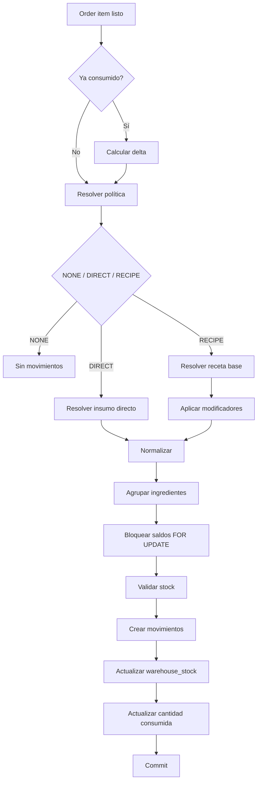
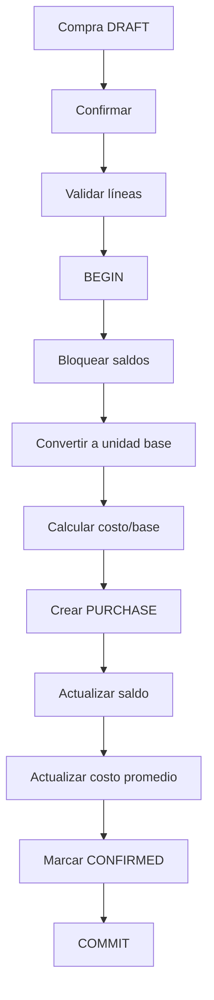
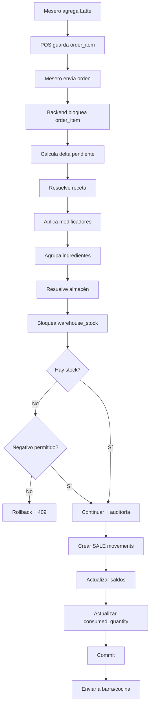

# Inventory Engine — Sistema POS para Cafetería

> Documento técnico para implementar el motor de inventario del sistema POS. Define reglas, algoritmos, contratos internos, manejo de recetas, conversiones, modificadores, movimientos, transacciones, reversas, mermas, redondeos y costeo.

---

# 1. Objetivo

El motor de inventario debe convertir cualquier evento operativo del POS en movimientos de stock consistentes, auditables e idempotentes.

Debe soportar:

- productos sin inventario;
- descuento directo por unidad;
- recetas;
- presentaciones de compra;
- unidades base;
- modificadores;
- sustituciones;
- agregados;
- cancelaciones;
- cortesías;
- mermas;
- devoluciones;
- ajustes;
- compras;
- transferencias entre almacenes;
- stock negativo configurable;
- costeo promedio;
- múltiples sucursales y almacenes;
- concurrencia entre terminales.

---

# 2. Principio fundamental

Nunca modificar inventario "a mano" sin registrar primero la causa.

Toda variación debe producir un movimiento en:

```text
stock_movements
```

El saldo en:

```text
warehouse_stock
```

es una proyección/materialización optimizada del ledger.

---

# 3. Políticas de inventario

Cada variante vendible utiliza una política:

```text
NONE
DIRECT
RECIPE
```

## NONE

No consume inventario.

## DIRECT

Descuenta directamente un insumo.

Ejemplo:

```text
Coca-Cola 355 ml
- 1 lata
```

## RECIPE

Resuelve ingredientes.

Ejemplo:

```text
Latte mediano
- 18 g café
- 333.333 ml leche
- 1 vaso
- 1 tapa
```

---

# 4. Unidad base

Todo insumo debe tener una única unidad base.

Ejemplos:

```text
Leche -> ml
Café -> g
Vasos -> piece
Refresco -> can
```

Todas las entradas y salidas del ledger se almacenan en esa unidad.

---

# 5. Presentaciones

Ejemplo:

```text
Leche
base = ml

Envase:
factor_to_base = 1000

Caja:
factor_to_base = 12000
```

Compra:

```text
10 cajas
```

Conversión:

```text
10 × 12000 = 120000 ml
```

Movimiento:

```text
PURCHASE +120000 ml
```

---

# 6. Precisión

Inventario:

```sql
DECIMAL(18,6)
```

Dinero:

```sql
DECIMAL(12,2)
```

Costo por unidad base:

```sql
DECIMAL(18,6)
```

Nunca utilizar `FLOAT` para cantidades críticas.

---

# 7. Momento de consumo

Configuración recomendada:

```text
ON_SEND
```

El inventario se consume cuando el producto se confirma y se envía a preparación.

Esto cubre correctamente:

- bebidas preparadas;
- descuentos;
- cortesías;
- cuentas familiares;
- cancelaciones posteriores;
- errores de preparación.

---

# 8. Estado de consumo

Cada `order_item` debe conocer:

```text
inventory_consumed
inventory_consumed_at
inventory_consumed_quantity
```

`inventory_consumed_quantity` permite trabajar por delta si la cantidad cambia después.

---

# 9. Flujo de alto nivel



---

# 10. DTO interno

```php
final class InventoryRequirementDTO
{
    public function __construct(
        public int $inventoryItemId,
        public string $quantity,
        public string $sourceType,
        public ?int $sourceId = null,
    ) {}
}
```

Las cantidades se manejan como strings decimales.

---

# 11. RecipeResolver

Responsabilidad:

```text
variante
+
modificadores
=
receta efectiva
```

Firma conceptual:

```php
resolve(
    ProductVariant $variant,
    Collection $modifiers,
    string $quantity
): Collection;
```

---

# 12. DIRECT

Ejemplo:

```text
Refresco
policy = DIRECT
direct_inventory_item_id = 12
direct_quantity = 1
```

Venta:

```text
quantity = 3
```

Resultado:

```text
inventory_item_id = 12
quantity = 3
```

---

# 13. RECIPE

Receta:

```text
Latte mediano
Leche 333.333 ml
Café 18 g
Vaso 1 pieza
Tapa 1 pieza
```

Venta:

```text
2 lattes
```

Resultado:

```text
Leche 666.666 ml
Café 36 g
Vaso 2
Tapa 2
```

---

# 14. Agrupación

Si dos reglas afectan el mismo insumo:

```text
Leche 300
Leche 50
```

agrupar antes de escribir:

```text
Leche 350
```

Esto reduce movimientos y bloqueos.

---

# 15. Modificadores

Acciones soportadas:

```text
ADD
REMOVE
REPLACE
MULTIPLY
```

Ejemplos:

```text
shot extra -> ADD
sin azúcar -> REMOVE
leche almendra -> REPLACE
doble café -> MULTIPLY
```

---

# 16. modifier_inventory_rules

Extensión recomendada:

```sql
CREATE TABLE modifier_inventory_rules (
    id BIGINT UNSIGNED AUTO_INCREMENT PRIMARY KEY,
    modifier_id BIGINT UNSIGNED NOT NULL,
    action VARCHAR(20) NOT NULL,
    target_inventory_item_id BIGINT UNSIGNED NULL,
    replacement_inventory_item_id BIGINT UNSIGNED NULL,
    quantity DECIMAL(18,6) NULL,
    multiplier DECIMAL(18,6) NULL,
    created_at DATETIME NULL,
    updated_at DATETIME NULL,

    FOREIGN KEY (modifier_id) REFERENCES modifiers(id),
    FOREIGN KEY (target_inventory_item_id) REFERENCES inventory_items(id),
    FOREIGN KEY (replacement_inventory_item_id) REFERENCES inventory_items(id)
);
```

---

# 17. ADD

```text
Shot extra
+18 g café
```

Base:

```text
18 g café
```

Resultado:

```text
36 g café
```

---

# 18. REMOVE

Base:

```text
Azúcar 10 g
```

Modificador:

```text
Sin azúcar
```

Resultado:

```text
Azúcar 0 g
```

---

# 19. REPLACE

Base:

```text
Leche entera 333 ml
```

Modificador:

```text
Leche de almendra
```

Resultado:

```text
Leche entera 0
Leche almendra 333 ml
```

No consumir primero leche entera para luego revertirla. Se resuelve la receta final antes de tocar stock.

---

# 20. MULTIPLY

```text
Doble shot
```

Base:

```text
Café 18 g
```

Resultado:

```text
36 g
```

---

# 21. Orden de aplicación

```text
1. Base recipe
2. REMOVE
3. REPLACE
4. MULTIPLY
5. ADD
6. Aggregate
```

Debe mantenerse estable para que dos terminales resuelvan igual una misma orden.

---

# 22. Ejemplo de receta efectiva

```text
Latte mediano

Base:
333 ml leche entera
18 g café
1 vaso
1 tapa

Modificadores:
leche almendra
shot extra
```

Resultado:

```text
333 ml leche almendra
36 g café
1 vaso
1 tapa
```

---

# 23. Validación de stock

Después de resolver la receta se bloquean los saldos:

```sql
SELECT *
FROM warehouse_stock
WHERE warehouse_id = ?
AND inventory_item_id IN (...)
ORDER BY inventory_item_id
FOR UPDATE;
```

---

# 24. Orden de bloqueo

Bloquear siempre por `inventory_item_id ASC` para reducir deadlocks.

---

# 25. Stock negativo

Prioridad:

```text
inventory_items.allow_negative
```

Si es `NULL`, utilizar:

```text
business_settings.negative_stock_enabled
```

---

# 26. Stock negativo deshabilitado

Requerido:

```text
333 ml
```

Disponible:

```text
200 ml
```

Resultado:

```text
InventoryInsufficientException
```

Rollback total.

---

# 27. Stock negativo habilitado

Disponible:

```text
200
```

Consumo:

```text
333
```

Saldo:

```text
-133
```

Registrar auditoría `NEGATIVE_STOCK`.

---

# 28. Consumo transaccional

```php
DB::transaction(function () use ($orderItem) {
    $orderItem = OrderItem::query()
        ->whereKey($orderItem->id)
        ->lockForUpdate()
        ->firstOrFail();

    $delta = bcsub(
        $orderItem->quantity,
        $orderItem->inventory_consumed_quantity ?? '0',
        3
    );

    if (bccomp($delta, '0', 3) <= 0) {
        return;
    }

    $requirements = $recipeResolver
        ->resolveOrderItem($orderItem, $delta)
        ->groupByInventoryItem();

    $stocks = $stockLocker->lockForRequirements(
        warehouseId: $warehouseId,
        requirements: $requirements,
    );

    $stockValidator->assertAvailable($requirements, $stocks);

    foreach ($requirements as $requirement) {
        $stockMovementService->consumeSale(
            orderItem: $orderItem,
            requirement: $requirement,
            stock: $stocks[$requirement->inventoryItemId],
        );
    }

    $orderItem->update([
        'inventory_consumed' => true,
        'inventory_consumed_quantity' => $orderItem->quantity,
        'inventory_consumed_at' => now(),
    ]);
});
```

---

# 29. Convención de signo

```text
entrada = positiva
salida = negativa
```

Venta:

```text
SALE -333.333000
```

Compra:

```text
PURCHASE +120000.000000
```

---

# 30. Snapshot de costo

En venta:

```text
unit_cost = warehouse_stock.average_cost
```

Guardar también:

```text
total_cost = abs(quantity) × unit_cost
```

Así los cambios futuros de costo no alteran ventas históricas.

---

# 31. Costo promedio ponderado

```text
new_avg =
(current_qty × current_avg + incoming_qty × incoming_unit_cost)
/
(current_qty + incoming_qty)
```

Si `current_qty <= 0`, recomendación:

```text
new_avg = incoming_unit_cost
```

---

# 32. Compra por presentación

```text
quantity = 10 cajas
factor_to_base = 12000 ml
unit_price = 300 por caja
```

Resultado:

```text
base_quantity = 120000 ml
base_unit_cost = 300 / 12000 = 0.025 por ml
```

Movimiento:

```text
PURCHASE +120000
unit_cost 0.025
```

---

# 33. Flujo de compra



---

# 34. Compras confirmadas

No editar una compra confirmada directamente.

Si se cancela, crear movimientos compensatorios:

```text
PURCHASE_CANCEL
```

---

# 35. Cancelación antes de preparación

Si `inventory_consumed_quantity = 0`:

```text
no hay movimiento de inventario
```

---

# 36. Cancelación después de preparación

Opciones:

```text
RETURN_TO_STOCK
WASTE
NO_ACTION
```

---

# 37. RETURN_TO_STOCK

Ejemplo: lata cerrada.

```text
SALE_CANCEL +1
```

---

# 38. WASTE

Ejemplo: latte preparado y desechado.

El consumo original se conserva.

Registrar:

```text
waste_record
```

No reingresar ingredientes que físicamente ya no existen.

---

# 39. Cortesías y descuentos

Afectan dinero, no inventario.

```text
Latte preparado + cortesía 100%
```

Inventario:

```text
consumo normal
```

Cobro:

```text
$0
```

---

# 40. Merma independiente

Ejemplo:

```text
Leche caducada 2000 ml
```

Generar:

```text
WASTE -2000
```

---

# 41. Ajustes

Conteo real superior:

```text
ADJUSTMENT +N
```

Conteo real inferior:

```text
ADJUSTMENT -N
```

Motivo obligatorio y permiso administrativo.

---

# 42. Transferencias

Origen:

```text
TRANSFER_OUT -1000
```

Destino:

```text
TRANSFER_IN +1000
```

Misma transacción.

---

# 43. Idempotencia

Operaciones críticas deben aceptar `idempotency_key`.

Ejemplo:

```text
order-send:100:version:4
```

Un retry no debe repetir movimientos.

---

# 44. Reversas ligadas al movimiento original

Agregar a `stock_movements`:

```sql
ALTER TABLE stock_movements
ADD COLUMN reversal_of_id BIGINT UNSIGNED NULL,
ADD CONSTRAINT fk_stock_movements_reversal
FOREIGN KEY (reversal_of_id) REFERENCES stock_movements(id);
```

Ejemplo:

```text
#500 SALE        -333 ml
#801 SALE_CANCEL +333 ml reversal_of_id=500
```

---

# 45. Regla de reversa

Nunca recalcular una receta actual para revertir una venta histórica.

Buscar los movimientos originales y generar movimientos opuestos.

Esto evita errores si la receta cambió después.

---

# 46. Prevención de doble reversa

Antes de revertir:

```sql
SELECT id
FROM stock_movements
WHERE reversal_of_id = ?
LIMIT 1;
```

Si existe:

```text
AlreadyReversedException
```

---

# 47. Redondeo

Inventario interno:

```text
6 decimales
```

Visualización:

```text
según unidad
```

Ejemplo:

```text
333.333333 ml
```

---

# 48. Caso 1 litro / 3 cafés

```text
1000 / 3 = 333.333333...
```

Con seis decimales:

```text
333.333333 × 3 = 999.999999
```

Residuo:

```text
0.000001 ml
```

Operativamente es irrelevante.

La receta debe representar la medida real usada por el negocio, no una división teórica perfecta si en barra se sirven 330, 335 o 340 ml.

---

# 49. Tolerancia visual

Puede definirse:

```text
epsilon = 0.000100
```

Valores menores se muestran como cero, sin alterar el ledger.

---

# 50. Consumo por delta

Agregar a `order_items`:

```sql
ALTER TABLE order_items
ADD COLUMN inventory_consumed_quantity DECIMAL(12,3) NOT NULL DEFAULT 0.000;
```

Fórmula:

```text
delta = desired_quantity - inventory_consumed_quantity
```

Si `delta > 0`, consumir solo la diferencia.

---

# 51. Reducción después de consumir

Si:

```text
consumed = 3
new quantity = 2
```

No revertir automáticamente.

Primero definir:

```text
¿el producto ya fue preparado?
```

Si no fue preparado, puede haber reversa.

Si fue preparado y se desecha, registrar merma.

---

# 52. Recipe snapshot

Los `stock_movements` son el snapshot real de lo consumido.

Una venta de ayer no depende de la receta configurada hoy.

---

# 53. BCMath

En PHP usar:

```php
bcadd()
bcsub()
bcmul()
bcdiv()
bccomp()
```

para matemática decimal crítica.

---

# 54. Decimal Value Object

Crear:

```text
app/Support/Decimal.php
```

Responsabilidades:

```text
scale fija
sumas
restas
multiplicaciones
divisiones
comparaciones
normalización
```

---

# 55. Servicios Laravel

```text
app/Services/Inventory/
├── InventoryConsumptionService.php
├── InventoryMovementService.php
├── InventoryPurchaseService.php
├── InventoryTransferService.php
├── InventoryAdjustmentService.php
├── InventoryReversalService.php
├── RecipeResolver.php
├── ModifierRecipeResolver.php
├── StockLocker.php
├── StockValidator.php
├── AverageCostCalculator.php
├── InventoryWarehouseResolver.php
└── UnitConverter.php
```

---

# 56. Enums

```php
enum InventoryPolicy: string
{
    case NONE = 'NONE';
    case DIRECT = 'DIRECT';
    case RECIPE = 'RECIPE';
}
```

```php
enum StockMovementType: string
{
    case INITIAL_STOCK = 'INITIAL_STOCK';
    case PURCHASE = 'PURCHASE';
    case PURCHASE_CANCEL = 'PURCHASE_CANCEL';
    case SALE = 'SALE';
    case SALE_CANCEL = 'SALE_CANCEL';
    case WASTE = 'WASTE';
    case ADJUSTMENT = 'ADJUSTMENT';
    case TRANSFER_IN = 'TRANSFER_IN';
    case TRANSFER_OUT = 'TRANSFER_OUT';
    case RETURN = 'RETURN';
}
```

---

# 57. UnitConverter

Las recetas deben guardarse preferentemente en unidad base.

Las conversiones se utilizan principalmente al recibir compras.

No permitir conversiones físicas incompatibles como:

```text
g -> ml
```

sin regla de densidad específica.

Para MVP no manejar densidad.

---

# 58. Tipos de unidad

```text
VOLUME
MASS
COUNT
```

Ejemplo:

```text
ml -> VOLUME
L  -> VOLUME
g  -> MASS
kg -> MASS
piece -> COUNT
```

---

# 59. Stock inicial

Siempre crear:

```text
INITIAL_STOCK
```

No modificar únicamente `warehouse_stock`.

---

# 60. Reconciliación

Comparar periódicamente:

```sql
SELECT
    warehouse_id,
    inventory_item_id,
    SUM(quantity) AS ledger_quantity
FROM stock_movements
GROUP BY warehouse_id, inventory_item_id;
```

contra `warehouse_stock.quantity`.

---

# 61. Rebuild

Comando sugerido:

```bash
php artisan inventory:rebuild-stock
```

Flujo:

```text
bloquear mantenimiento
recalcular ledger
comparar
actualizar saldo
registrar auditoría
```

---

# 62. Commands

```text
inventory:audit
inventory:rebuild-stock
inventory:low-stock
inventory:recalculate-costs
```

---

# 63. Stock mínimo

Si:

```text
quantity <= minimum_stock
```

marcar alerta `LOW_STOCK`.

No crear movimiento.

---

# 64. Disponibilidad teórica

Ejemplo Latte:

```text
Leche: 1000 / 333 = 3
Café: 500 / 18 = 27
Vasos: 20 / 1 = 20
```

Disponibilidad teórica:

```text
3
```

Pero la validación definitiva siempre debe ocurrir en transacción.

---

# 65. Almacén predeterminado

Agregar por sucursal:

```text
default_sales_warehouse_id
```

o resolverlo mediante configuración.

---

# 66. Almacén por área de preparación

Fase avanzada:

```text
BAR -> BARRA
KITCHEN -> COCINA
```

`InventoryWarehouseResolver` decide de qué almacén consumir.

---

# 67. Merma de producto preparado

Un latte preparado no necesita existir como `inventory_item`.

Puede registrarse:

```text
waste_record
order_item_id
reason = PREPARATION_ERROR
```

sin crear otro movimiento si los ingredientes ya fueron consumidos.

---

# 68. Consumo teórico vs real

Teórico:

```text
ventas × recetas
```

Real:

```text
stock inicial + compras - stock final
```

La diferencia ayuda a detectar:

```text
sobreporciones
merma no registrada
errores
pérdidas
```

---

# 69. Costo de una orden

```text
SUM(ABS(stock_movements.total_cost))
```

para movimientos `SALE` ligados a sus `order_items`.

---

# 70. Margen

```text
margen bruto = ingreso neto - costo de inventario consumido
```

---

# 71. No alterar historial

Cambiar precio:

```text
no afecta inventario histórico
```

Cambiar receta:

```text
solo afecta ventas futuras
```

---

# 72. Excepciones

```text
InventoryNotConfiguredException
InventoryInsufficientException
RecipeNotFoundException
InvalidInventoryPolicyException
WarehouseNotFoundException
AlreadyConsumedException
AlreadyReversedException
InvalidUnitConversionException
```

---

# 73. Error HTTP

Stock insuficiente:

```http
409 Conflict
```

```json
{
  "code": "INSUFFICIENT_STOCK",
  "message": "No hay suficiente leche.",
  "details": {
    "inventory_item_id": 15,
    "required": "333.000000",
    "available": "200.000000",
    "unit": "ml"
  }
}
```

---

# 74. Costos y permisos

Sin permiso:

```text
inventory.view_cost
```

no exponer:

```text
average_cost
inventory_value
total_cost
```

---

# 75. Pruebas unitarias obligatorias

```text
DIRECT consumes correct quantity
RECIPE consumes all ingredients
ADD modifier works
REMOVE modifier works
REPLACE modifier works
MULTIPLY modifier works
aggregation works
negative stock blocked
negative stock allowed
purchase conversion works
weighted average works
sale reversal works
double consumption blocked
double reversal blocked
transfer atomic
rollback leaves stock unchanged
```

---

# 76. Prueba de concurrencia

Stock:

```text
1 lata
```

Dos terminales intentan vender al mismo tiempo.

Esperado:

```text
1 venta OK
1 venta 409
```

con stock negativo deshabilitado.

---

# 77. Prueba de atomicidad

Receta:

```text
leche disponible
café insuficiente
```

Esperado:

```text
ningún ingrediente se descuenta
```

---

# 78. Ejemplo completo

Stock:

```text
Leche entera   120000 ml
Café             5000 g
Vasos             100
Tapas             100
Leche almendra  10000 ml
```

Orden:

```text
2 Latte mediano
1 Latte mediano + leche almendra + shot extra
```

Receta base:

```text
333 ml leche
18 g café
1 vaso
1 tapa
```

Total efectivo:

```text
Leche entera   -666 ml
Leche almendra -333 ml
Café            -72 g
Vasos             -3
Tapas             -3
```

---

# 79. Resultado de stock

```text
Leche entera   119334 ml
Leche almendra   9667 ml
Café             4928 g
Vasos               97
Tapas               97
```

---

# 80. Cortesía del tercer latte

Inventario:

```text
sin movimientos extra
```

Finanzas:

```text
courtesy_total += precio
```

---

# 81. Cancelación del tercer latte

Si se tiró:

```text
waste_record
sin reversa
```

Si nunca se preparó:

```text
reversa de movimientos originales
```

---

# 82. Pseudocódigo RecipeResolver

```php
public function resolveOrderItem(
    OrderItem $item,
    string $quantity
): Collection {
    $variant = $item->variant;

    $requirements = match ($variant->effectiveInventoryPolicy()) {
        InventoryPolicy::NONE => collect(),

        InventoryPolicy::DIRECT => collect([
            new InventoryRequirementDTO(
                inventoryItemId: $variant->direct_inventory_item_id,
                quantity: bcmul(
                    $variant->direct_quantity,
                    $quantity,
                    6
                ),
                sourceType: 'DIRECT',
                sourceId: $variant->id,
            ),
        ]),

        InventoryPolicy::RECIPE => $this
            ->recipeRequirements($variant, $quantity),
    };

    return $this->modifierResolver
        ->apply($requirements, $item->modifiers)
        ->groupByInventoryItem();
}
```

---

# 83. Pseudocódigo de movimiento

```php
public function createSaleConsumption(
    OrderItem $item,
    InventoryRequirementDTO $requirement,
    WarehouseStock $stock
): StockMovement {
    $quantity = bcmul($requirement->quantity, '-1', 6);

    $movement = StockMovement::create([
        'business_id' => $item->order->business_id,
        'branch_id' => $item->order->branch_id,
        'warehouse_id' => $stock->warehouse_id,
        'inventory_item_id' => $stock->inventory_item_id,
        'movement_type' => StockMovementType::SALE->value,
        'quantity' => $quantity,
        'unit_cost' => $stock->average_cost,
        'total_cost' => bcmul(
            ltrim($quantity, '-'),
            $stock->average_cost,
            6
        ),
        'reference_type' => 'ORDER_ITEM',
        'reference_id' => $item->id,
        'occurred_at' => now(),
    ]);

    $stock->update([
        'quantity' => bcadd($stock->quantity, $quantity, 6),
    ]);

    return $movement;
}
```

---

# 84. Frontend no es autoridad

Frontend envía:

```text
product_variant_id
quantity
modifier_ids
```

Backend recalcula:

```text
precio
receta
stock
permisos
totales
```

Nunca aceptar del navegador:

```text
inventory_quantity_to_discount
stock_after
cost
```

---

# 85. Cache

Se puede cachear:

```text
catálogo
categorías
recetas
```

No usar cache de larga duración para validar existencias en una venta.

---

# 86. Eventos Laravel

```text
OrderSent
InventoryConsumed
StockLow
PurchaseConfirmed
InventoryAdjusted
WasteRecorded
StockTransferred
```

El consumo principal debe ocurrir síncronamente dentro de la transacción.

---

# 87. Jobs asíncronos

Sí:

```text
notificaciones
reportes
métricas
alertas
emails
```

No:

```text
descontar stock principal después de responder al POS
```

---

# 88. Integridad ante fallos

Si falla antes de `COMMIT`:

```text
0 movimientos persistidos
0 saldos modificados
```

Si hace `COMMIT`:

```text
movimientos y saldos quedan alineados
```

---

# 89. Auditoría

Acciones:

```text
STOCK_ADJUSTMENT
WASTE
PURCHASE_CONFIRM
PURCHASE_CANCEL
STOCK_TRANSFER
NEGATIVE_STOCK
SALE_REVERSAL
```

---

# 90. Query de historial

```sql
SELECT
    occurred_at,
    movement_type,
    quantity,
    unit_cost,
    total_cost,
    reference_type,
    reference_id,
    reversal_of_id,
    reason
FROM stock_movements
WHERE inventory_item_id = ?
AND warehouse_id = ?
ORDER BY occurred_at DESC, id DESC;
```

---

# 91. Estrategia de lotes

MVP:

```text
Weighted Average Cost
```

No implementar inicialmente:

```text
FIFO
FEFO
lotes
caducidades
```

salvo requerimiento real del cliente.

---

# 92. Producción interna futura

Para jarabes, mezclas o repostería:

```text
PRODUCTION_CONSUME
PRODUCTION_OUTPUT
```

Ejemplo:

```text
-1000 g azúcar
-1000 ml agua
+1800 ml jarabe
```

---

# 93. MVP de tipos de movimiento

```text
INITIAL_STOCK
PURCHASE
PURCHASE_CANCEL
SALE
SALE_CANCEL
WASTE
ADJUSTMENT
TRANSFER_IN
TRANSFER_OUT
```

---

# 94. Checklist antes de consumir

```text
variant exists
variant active
product active
policy valid
recipe exists if RECIPE
recipe ingredients valid
warehouse resolved
stock rows exist
stock sufficient OR negative enabled
order not PAID/CANCELLED
idempotency valid
```

---

# 95. warehouse_stock faltante

Inicializar la fila al asignar el insumo al almacén:

```text
quantity = 0
average_cost = 0
```

Evitar crearla de forma improvisada durante una venta concurrente.

---

# 96. Permisos

```text
inventory.view
inventory.view_cost
inventory.adjust
inventory.waste
inventory.transfer
inventory.allow_negative
inventory.rebuild
```

---

# 97. API sugerida

```text
GET  /api/inventory
GET  /api/inventory/{id}
GET  /api/inventory/{id}/movements

POST /api/inventory/{id}/adjust
POST /api/inventory/waste
POST /api/inventory/transfers

POST /api/purchases/{id}/confirm
POST /api/orders/{id}/send
POST /api/order-items/{id}/reverse-inventory
```

---

# 98. Request de ajuste

```json
{
  "warehouse_id": 2,
  "quantity": "-3.000000",
  "reason": "Diferencia en conteo físico"
}
```

---

# 99. Request de merma

```json
{
  "warehouse_id": 2,
  "inventory_item_id": 15,
  "quantity": "500.000000",
  "reason": "Leche derramada"
}
```

Backend genera:

```text
WASTE -500
```

---

# 100. Request de transferencia

```json
{
  "from_warehouse_id": 1,
  "to_warehouse_id": 2,
  "items": [
    {
      "inventory_item_id": 15,
      "quantity": "3000.000000"
    }
  ]
}
```

---

# 101. JSON decimal

Enviar decimales como string:

```json
{
  "quantity": "333.333333"
}
```

En TypeScript:

```ts
type DecimalString = string;
```

---

# 102. Visualización de stock

El stock base:

```text
120000 ml
```

puede mostrarse como:

```text
10 cajas
120 envases
120 L
```

pero esas son vistas calculadas, no saldos independientes.

---

# 103. Conversión visual

Ejemplo:

```text
boxes = floor(base_qty / 12000)
remainder = base_qty % 12000
```

Nunca escribir de vuelta esa presentación al ledger.

---

# 104. Regla arquitectónica final

Separar:

```text
Recipe Resolution
Modifier Resolution
Stock Locking
Stock Validation
Movement Creation
Balance Update
Costing
Reversal
Audit
```

Evitar un `InventoryService` monolítico.

---

# 105. Flujo completo de ejemplo



---

# 106. Cambios recomendados a database-schema.md

Agregar:

```sql
ALTER TABLE order_items
ADD COLUMN inventory_consumed_quantity DECIMAL(12,3) NOT NULL DEFAULT 0.000;
```

Agregar:

```sql
ALTER TABLE stock_movements
ADD COLUMN reversal_of_id BIGINT UNSIGNED NULL,
ADD CONSTRAINT fk_stock_movements_reversal
FOREIGN KEY (reversal_of_id) REFERENCES stock_movements(id);
```

Agregar opcionalmente:

```text
modifier_inventory_rules
```

para modelar sustituciones y agregados de forma declarativa.

---

# 107. Criterios de aceptación

El motor estará listo cuando pase correctamente estos escenarios:

```text
1. Compra 10 cajas de leche y convierte a ml.
2. Venta de producto DIRECT descuenta una unidad.
3. Venta RECIPE descuenta múltiples ingredientes.
4. Shot extra agrega café.
5. Leche almendra sustituye leche normal.
6. Cortesía conserva consumo.
7. Descuento conserva consumo.
8. Cancelación antes de preparar no consume.
9. Cancelación preparada puede convertirse en merma.
10. Reversa usa movimientos históricos.
11. Dos terminales no pueden consumir la misma última unidad.
12. Fallo intermedio revierte toda la transacción.
13. Compra actualiza costo promedio.
14. Transferencia conserva stock total del negocio.
15. Auditoría detecta diferencias ledger vs warehouse_stock.
```

---

# 108. Próximo documento

El siguiente documento recomendado es:

```text
api-contract.md
```

Ahí se deben definir:

- autenticación;
- versionado `/api/v1`;
- endpoints;
- payloads;
- responses;
- errores;
- permisos;
- paginación;
- filtros;
- idempotencia;
- órdenes;
- mesas;
- inventario;
- compras;
- caja;
- reportes;
- configuración;
- menú público.
