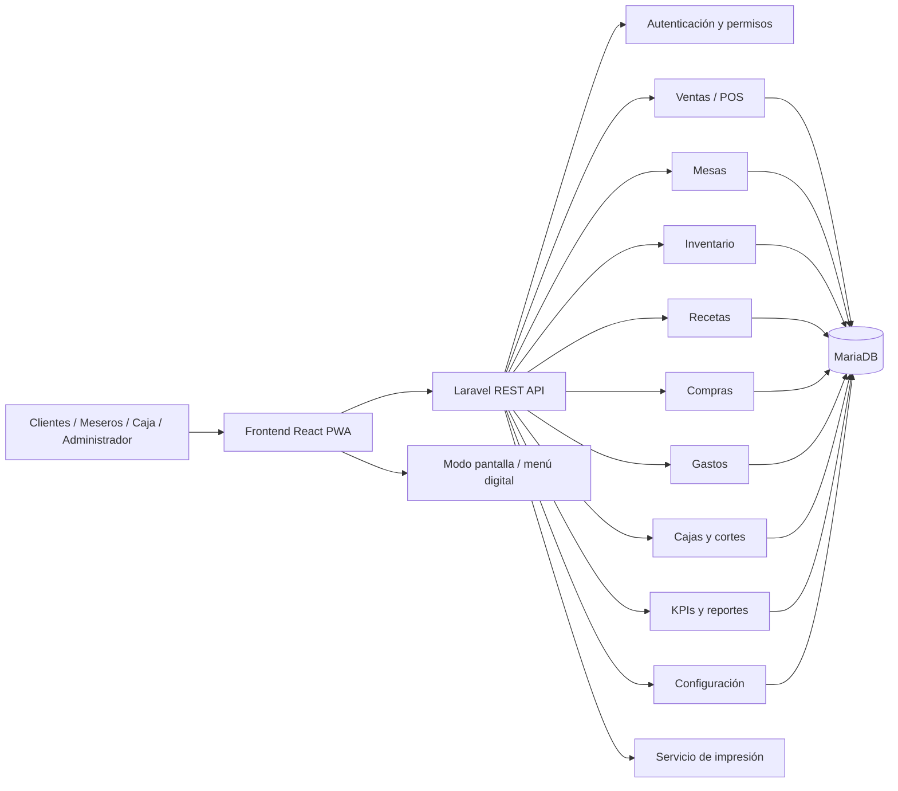
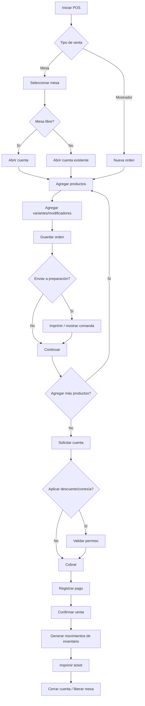
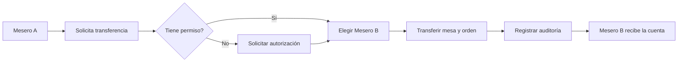
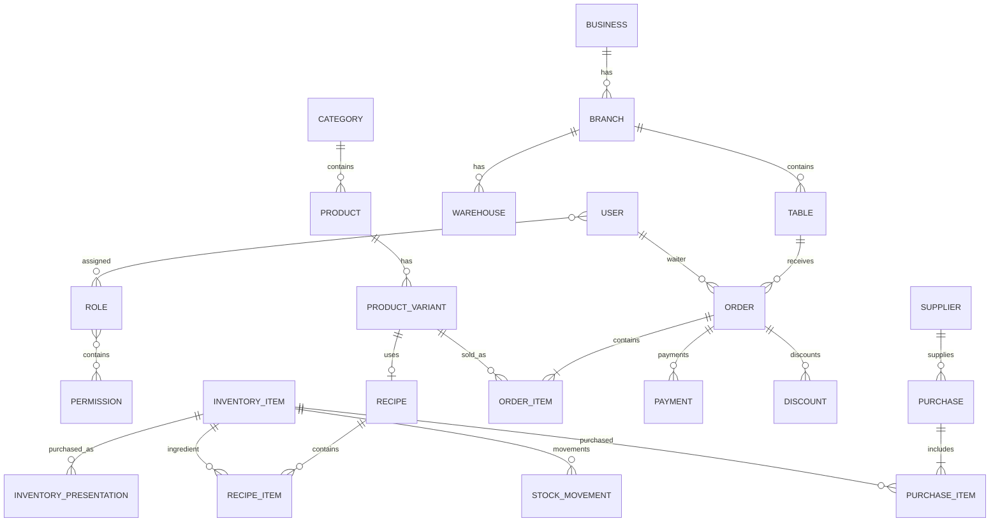
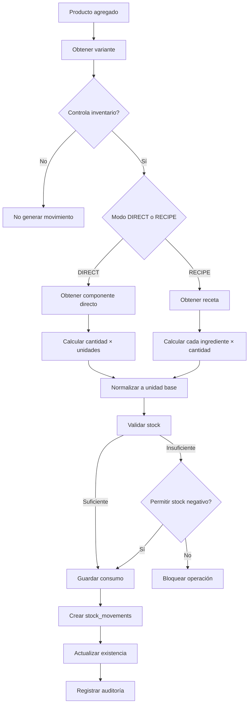
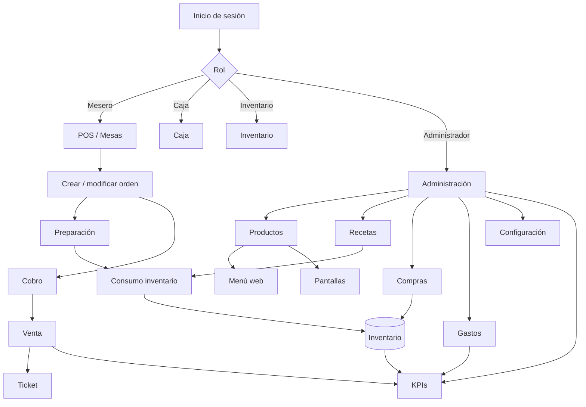

# Plan de desarrollo — Sistema POS e Inventario para Cafetería

> Documento técnico base para el desarrollo de un sistema POS web modular, personalizable y compatible con despliegue de frontend en Vercel y producción en hosting con cPanel + MariaDB.

---

## 1. Objetivo general

Desarrollar un sistema web de punto de venta (POS) para cafeterías que permita administrar:

- ventas en mostrador y por mesas;
- órdenes abiertas por mesa;
- asignación y traspaso de mesas entre meseros;
- impresión de tickets;
- menú público web;
- menú para pantallas grandes;
- productos, categorías, variantes y modificadores;
- inventario tradicional por unidad, pieza, lata, botella, paquete o caja;
- inventario por ingredientes y recetas;
- conversiones de unidades de compra a unidades reales de consumo;
- descuentos;
- cortesías parciales o totales;
- cancelaciones con autorización;
- compras, gastos y proveedores;
- cajas y cortes de caja;
- usuarios, roles y permisos;
- bitácora de operaciones;
- indicadores/KPIs;
- configuración visual por cliente: colores, logo, tema y datos comerciales.

El sistema deberá funcionar tanto para cafeterías que requieren recetas e inventario detallado como para negocios que solamente desean descontar unidades completas.

---

# 2. Principios de arquitectura

## 2.1 Sistema modular

El proyecto debe evitar que todos los clientes estén obligados a utilizar todas las funciones.

Cada negocio podrá habilitar o deshabilitar módulos como:

- Recetario.
- Inventario.
- Mesas.
- Meseros.
- Compras.
- Gastos.
- Pantallas de menú.
- Descuentos.
- Cortesías.
- Impresión.
- KPIs avanzados.

Esto permitirá utilizar el mismo sistema para cafeterías pequeñas, medianas o con operación más compleja.

---

## 2.2 Inventario basado en una unidad base

Para evitar errores de stock, cada insumo deberá tener una **unidad base de inventario**.

Ejemplo:

```text
Producto de inventario: Leche entera
Unidad base: mililitro (ml)

Presentación 1:
1 envase = 1,000 ml

Presentación 2:
1 caja = 12 envases
1 caja = 12,000 ml
```

Si se compran:

```text
10 cajas × 12,000 ml = 120,000 ml
```

el stock real almacenado será:

```text
120,000 ml
```

aunque para el usuario pueda mostrarse:

```text
10 cajas
120 envases
120 litros
```

Esto permite manejar simultáneamente compras por caja y consumo por receta.

---

## 2.3 Inventario normal y por receta

Cada producto vendible tendrá una política de inventario configurable.

```text
NONE        No descuenta inventario.
DIRECT      Descuenta una unidad de inventario.
RECIPE      Descuenta uno o varios ingredientes.
```

Internamente, DIRECT y RECIPE pueden utilizar el mismo motor de movimientos.

### Ejemplo: bebida en lata

```text
Coca-Cola 355 ml
- 1 lata de Coca-Cola
```

Al venderla:

```text
stock -= 1 lata
```

### Ejemplo: café con leche

```text
Café latte
- Café molido: 18 g
- Leche: 333.333 ml
- Vaso: 1 pieza
- Tapa: 1 pieza
```

Cada venta generará automáticamente los movimientos:

```text
-18 g café
-333.333 ml leche
-1 vaso
-1 tapa
```

De esta manera, si un litro de leche alcanza exactamente para tres cafés:

```text
1,000 / 3 = 333.333333 ml por café
```

el sistema podrá descontar la leche proporcionalmente.

> Recomendación: almacenar cantidades con `DECIMAL`, no `FLOAT`, para evitar errores acumulados.

---

# 3. Tecnología recomendada

## Backend

### Laravel 13

```text
PHP 8.3+
Laravel 13
REST API
Laravel Sanctum
MariaDB
```

### Razones

- Excelente compatibilidad con hosting PHP/cPanel.
- No necesita mantener un proceso Node.js activo.
- Compatible con MariaDB mediante PDO.
- Buen sistema de autenticación, validación, migraciones y colas.
- Permite cron jobs mediante Scheduler.
- Facilita permisos, auditoría y APIs.
- Puede ejecutarse en un subdominio:

```text
api.cafeteria.com
```

Laravel 13 requiere PHP 8.3 o superior, por lo que deberá verificarse esta versión antes de contratar o configurar el hosting.

---

## Frontend

### React + Vite + TypeScript

```text
React
TypeScript
Vite
React Router
TanStack Query
Zustand
Tailwind CSS
PWA
```

### Razones

- Desarrollo rápido.
- Aplicación altamente interactiva.
- Ideal para pantallas táctiles.
- Puede instalarse como PWA.
- El build final es estático.
- Puede desplegarse fácilmente en Vercel.
- También puede alojarse directamente en cPanel.
- No requiere Node.js ejecutándose en producción después de compilarse.

---

# 4. Estrategia de despliegue

## Desarrollo

```text
Frontend
localhost:5173

Backend
localhost:8000

Base de datos
MariaDB local / Docker
```

---

## Pruebas

```text
Frontend:
Vercel

Backend:
Servidor de pruebas / subdominio cPanel

Base de datos:
MariaDB de pruebas
```

Ejemplo:

```text
https://cafeteria-demo.vercel.app
           |
           v
https://api-demo.midominio.com
           |
           v
MariaDB TEST
```

> Vercel debe utilizarse principalmente para el frontend. La base de datos no debe residir dentro del filesystem de una función o deployment de Vercel.

---

## Producción — opción recomendada

```text
www.cafeteria.com
        |
        +--> Frontend React
        |
api.cafeteria.com
        |
        +--> Laravel API
                |
                +--> MariaDB cPanel
```

El frontend puede:

1. permanecer alojado en Vercel utilizando el dominio personalizado; o
2. compilarse con Vite y copiarse como sitio estático al hosting cPanel.

La segunda alternativa permite alojar todo bajo el mismo hosting sin requerir Node.js en producción.

---

# 5. Arquitectura general



---

# 6. Módulos funcionales

## 6.1 Autenticación

Funciones:

- Inicio de sesión.
- Cierre de sesión.
- recuperación de contraseña;
- PIN rápido para POS;
- sesiones por dispositivo;
- permisos por usuario;
- bloqueo automático opcional.

---

## 6.2 Roles

Roles sugeridos:

```text
SUPER_ADMIN
ADMIN
GERENTE
CAJERO
MESERO
COCINA
INVENTARIO
CONSULTA
```

Los permisos no deben depender solamente del rol.

Ejemplo:

```text
sales.create
sales.discount
sales.courtesy
sales.cancel
sales.refund
tables.transfer
inventory.adjust
inventory.view_cost
cash.open
cash.close
reports.view
settings.update
```

---

# 7. POS

La pantalla POS deberá estar optimizada para uso táctil.

Elementos:

- Categorías.
- Productos.
- Buscador.
- Productos favoritos.
- Orden actual.
- Cantidad.
- Modificadores.
- Notas.
- Cliente.
- Mesa.
- Mesero.
- Descuento.
- Cortesía.
- Cobro.
- Impresión.

---

# 8. Estados de una orden

```text
OPEN
SENT
PREPARING
READY
SERVED
PARTIALLY_PAID
PAID
CANCELLED
```

No todos los negocios necesitan cocina, por lo que algunos estados pueden omitirse mediante configuración.

---

# 9. Flujo principal de una venta



---

# 10. Mesas

Cada mesa deberá incluir:

```text
id
name
area_id
capacity
status
current_order_id
assigned_waiter_id
```

Estados:

```text
AVAILABLE
OCCUPIED
RESERVED
DISABLED
```

La interfaz podrá mostrar un plano sencillo:

```text
TERRAZA

[M1] [M2] [M3]

INTERIOR

[M4] [M5] [M6]
```

Colores por estado configurables.

---

# 11. Traspaso entre meseros

El sistema deberá permitir transferir:

- una mesa completa;
- una orden;
- varias mesas.

Flujo:



Auditoría:

```text
mesa
orden
mesero anterior
mesero nuevo
usuario que autorizó
fecha/hora
motivo
```

---

# 12. Productos del menú

Campos sugeridos:

```text
id
category_id
sku
name
description
image
price
cost
tax_id
inventory_policy
active
visible_web
visible_pos
visible_display
preparation_area
```

---

# 13. Categorías

Ejemplos:

```text
Café caliente
Café frío
Té
Panadería
Postres
Alimentos
Bebidas
Extras
```

---

# 14. Variantes

Ejemplo:

```text
Latte

CHICO   $55
MEDIANO $65
GRANDE  $75
```

Cada variante puede tener receta propia.

Ejemplo:

```text
Latte chico
- 250 ml leche

Latte mediano
- 333 ml leche

Latte grande
- 420 ml leche
```

---

# 15. Modificadores

Ejemplos:

```text
+ Shot extra
Leche deslactosada
Leche vegetal
Sin azúcar
Jarabe vainilla
Crema batida
```

Un modificador puede:

- cambiar el precio;
- cambiar ingredientes;
- añadir ingredientes;
- retirar ingredientes.

Ejemplo:

```text
Leche de almendra
- leche normal 333 ml
+ leche de almendra 333 ml
```

---

# 16. Inventario

## Entidades principales

### InventoryItem

```text
id
sku
name
base_unit_id
minimum_stock
maximum_stock
current_stock
average_cost
track_inventory
active
```

Ejemplos:

```text
Leche
Café
Chocolate
Vasos 12 oz
Tapas
Coca-Cola
Servilletas
```

---

# 17. Unidades de medida

Tabla:

```text
units
```

Ejemplos:

```text
ml
L
mg
g
kg
pieza
lata
botella
paquete
caja
```

No todas serán directamente convertibles.

Ejemplo válido:

```text
1 L = 1000 ml
```

Ejemplo definido por producto:

```text
1 caja de leche = 12 envases
1 envase = 1000 ml
```

---

# 18. Presentaciones de compra

Tabla conceptual:

```text
inventory_presentations
```

Ejemplo:

```text
Leche

BASE:
ml

PRESENTACIONES:

Envase
factor = 1000 ml

Caja
factor = 12000 ml
```

Al registrar compra:

```text
Cantidad: 10
Presentación: Caja
```

el backend calcula:

```text
10 × 12,000 = 120,000 ml
```

---

# 19. Recetario

Tabla:

```text
recipes
recipe_items
```

Ejemplo:

```text
Latte mediano

Café molido   18 g
Leche         333.333 ml
Vaso          1 pieza
Tapa          1 pieza
```

La receta puede asociarse a:

- producto;
- variante;
- modificador.

---

# 20. Motor de stock

Nunca se deberá modificar solamente:

```text
inventory.current_stock
```

Toda entrada o salida deberá generar un movimiento.

Tabla:

```text
stock_movements
```

Tipos:

```text
PURCHASE
SALE
SALE_CANCEL
WASTE
ADJUSTMENT
TRANSFER_IN
TRANSFER_OUT
RETURN
COURTESY
INITIAL_STOCK
```

Campos:

```text
id
inventory_item_id
warehouse_id
movement_type
quantity
unit_cost
reference_type
reference_id
user_id
reason
created_at
```

Ejemplo:

```text
Venta #1523
Latte

Leche      -333.333 ml
Café         -18 g
Vaso          -1
Tapa          -1
```

---

# 21. Momento de descuento de inventario

Recomendación:

Descontar stock cuando el producto se **confirma/envía a preparación**, no solamente cuando se paga.

Razón:

Una bebida preparada consume ingredientes aunque posteriormente se convierta en:

- cortesía;
- descuento 100%;
- cuenta de familiares;
- invitación;
- merma por error.

Si se cancela antes de preparar, no hay consumo.

Si se cancela después de preparar, debe registrarse como merma o cancelación con afectación de inventario.

---

# 22. Cortesías

Una cortesía no debe eliminar la venta.

Debe conservar:

```text
precio original
descuento
importe cobrado
motivo
usuario solicitante
usuario autorizador
productos consumidos
costo real
inventario utilizado
```

Ejemplo:

```text
Cuenta original: $420
Cortesía:        $420
Cobrado:           $0
Costo insumos:   $138
```

Esto permite conocer cuánto representan las cortesías para el negocio.

---

# 23. Descuentos

Tipos:

```text
PORCENTAJE
MONTO
PRODUCTO
CUENTA_COMPLETA
```

Reglas:

```text
máximo permitido por rol;
motivo obligatorio;
autorización;
vigencia;
productos permitidos;
horario.
```

---

# 24. Cancelaciones

Toda cancelación debe guardar:

```text
usuario
fecha
motivo
orden
producto
cantidad
importe
estado de preparación
afectación inventario
usuario autorizador
```

No deberán eliminarse registros físicos de ventas.

Se recomienda utilizar operaciones reversibles y auditoría.

---

# 25. Pagos

Métodos:

```text
EFECTIVO
TARJETA
TRANSFERENCIA
QR
VALE
OTRO
```

Debe permitirse pago dividido:

```text
Total: $500

Efectivo: $200
Tarjeta:  $300
```

y división de cuenta:

```text
por productos
por personas
por monto
```

---

# 26. Caja

Funciones:

- Apertura de caja.
- Fondo inicial.
- Entradas.
- Salidas.
- Ventas.
- Retiros.
- Corte parcial.
- Corte final.
- Diferencia de caja.

Ejemplo:

```text
Fondo inicial      $1,000
Ventas efectivo    $6,500
Entradas             $200
Retiros            -$2,000
Esperado            $5,700
Contado             $5,650
Diferencia            -$50
```

---

# 27. Compras

Campos:

```text
supplier
invoice_number
purchase_date
items
quantity
presentation
unit_cost
tax
total
payment_status
```

Una compra confirmada generará automáticamente movimientos `PURCHASE`.

---

# 28. Proveedores

Datos:

```text
nombre
razón social
RFC
contacto
teléfono
correo
dirección
notas
```

---

# 29. Gastos

Categorías:

```text
Renta
Gas
Electricidad
Internet
Mantenimiento
Papelería
Limpieza
Transporte
Otros
```

Debe distinguirse:

```text
COMPRA_DE_INVENTARIO
GASTO_OPERATIVO
```

para no duplicar información financiera.

---

# 30. Mermas

Debe existir módulo específico.

Ejemplos:

```text
leche caducada
vaso roto
bebida preparada incorrectamente
alimento quemado
producto derramado
```

Campos:

```text
insumo
cantidad
motivo
usuario
fecha
orden relacionada opcional
```

---

# 31. Menú web público

Ruta sugerida:

```text
/menu
```

Contenido:

- logo;
- categorías;
- fotografías;
- nombre;
- descripción;
- precio;
- disponibilidad;
- etiquetas.

Ejemplos:

```text
Nuevo
Vegano
Sin azúcar
Favorito
Picante
```

Puede habilitarse QR:

```text
https://cafeteria.com/menu
```

---

# 32. Pantallas de menú

Ruta:

```text
/display
```

Modo:

```text
fullscreen
auto refresh
sin controles administrativos
```

Puede utilizar:

- promociones;
- imágenes;
- precios;
- productos destacados;
- carruseles;
- videos opcionales.

Configuración por pantalla:

```text
display_1
display_2
display_3
```

---

# 33. Impresión

Tipos:

```text
Ticket cliente
Comanda barra
Comanda cocina
Precuenta
Corte de caja
Reporte
```

Arquitectura recomendada:

```text
POS web
   |
   +--> impresión navegador
   |
   +--> servicio local de impresión opcional
```

Para impresoras térmicas ESC/POS, conviene implementar posteriormente un **Print Agent** local para evitar depender completamente del diálogo de impresión del navegador.

---

# 34. KPIs

## Ventas

```text
Ventas del día
Ventas del mes
Ticket promedio
Número de órdenes
Productos vendidos
Ventas por hora
Ventas por categoría
Ventas por producto
Ventas por mesero
Ventas por método de pago
```

## Rentabilidad

```text
Costo de venta
Utilidad bruta
Margen
Costo por producto
```

## Inventario

```text
Stock actual
Stock bajo
Valor del inventario
Rotación
Mermas
Consumo teórico
Consumo real
Diferencias
```

## Compras

```text
Compras por periodo
Compras por proveedor
Costo promedio
Último costo
Variación de costo
```

## Gastos

```text
Gastos del mes
Gasto por categoría
Gasto vs ventas
```

## Operación

```text
Tiempo promedio de cuenta
Mesas atendidas
Órdenes por mesero
Descuentos
Cortesías
Cancelaciones
```

---

# 35. Dashboard

Ejemplo:

```text
┌────────────────┬────────────────┬────────────────┐
│ VENTAS HOY     │ TICKET PROM.   │ ÓRDENES        │
│ $18,540        │ $246           │ 75             │
└────────────────┴────────────────┴────────────────┘

┌────────────────┬────────────────┬────────────────┐
│ COSTO          │ UTILIDAD       │ GASTOS         │
│ $6,120         │ $12,420        │ $2,300         │
└────────────────┴────────────────┴────────────────┘

Ventas por hora
████████████████████

Top productos
1 Latte
2 Americano
3 Croissant
```

---

# 36. Configuración visual

Tabla sugerida:

```text
business_settings
```

Opciones:

```text
business_name
logo
favicon
primary_color
secondary_color
accent_color
background_color
font_family
border_radius
dark_mode
ticket_logo
display_logo
```

Variables CSS:

```css
:root {
  --color-primary: #6f4e37;
  --color-secondary: #d7b899;
  --color-accent: #c98b4a;
  --radius: 12px;
}
```

La interfaz utilizará tokens en vez de colores escritos directamente en componentes.

---

# 37. Multi-sucursal

Aunque inicialmente exista una cafetería, la base de datos debería incluir desde el principio:

```text
business_id
branch_id
warehouse_id
```

Esto evita una migración compleja si posteriormente se agregan sucursales.

---

# 38. Modelo conceptual de datos



---

# 39. Tablas principales de base de datos

```text
businesses
branches

users
roles
permissions
role_user
permission_role

business_settings

areas
tables

categories
products
product_variants
modifier_groups
modifiers
product_modifier_groups

units
inventory_items
inventory_presentations
warehouses
warehouse_stock
stock_movements

recipes
recipe_items

suppliers
purchases
purchase_items

orders
order_items
order_item_modifiers
order_status_history

payments
payment_methods

discounts
courtesies
cancellations

cash_registers
cash_sessions
cash_movements

expenses
expense_categories

waste_records

printers
print_jobs

displays
display_playlists

audit_logs
```

---

# 40. Concurrencia

Un POS puede recibir ventas desde varios dispositivos.

Por ello:

- las operaciones de stock deben ejecutarse dentro de transacciones;
- no confiar en cantidades calculadas solamente en frontend;
- bloquear o validar stock desde backend;
- evitar doble cobro de la misma orden;
- utilizar `idempotency_key` en operaciones sensibles.

Ejemplo:

```text
POST /orders/{id}/pay

idempotency_key:
550e8400-e29b-41d4-a716-446655440000
```

---

# 41. Auditoría

Eventos importantes deberán registrarse.

```text
LOGIN
PRICE_CHANGE
DISCOUNT
COURTESY
CANCEL
REFUND
TABLE_TRANSFER
STOCK_ADJUSTMENT
CASH_OPEN
CASH_CLOSE
USER_PERMISSION_CHANGE
```

Campos:

```text
user_id
action
entity
entity_id
old_values
new_values
ip
device
created_at
```

---

# 42. Seguridad

## Backend

- HTTPS obligatorio.
- Validación server-side.
- Rate limiting.
- Laravel Sanctum.
- CSRF cuando corresponda.
- Contraseñas con hashing seguro.
- Roles y permisos.
- SQL mediante ORM/Query Builder.
- Variables sensibles en `.env`.
- Backups automáticos.
- Logs sin datos confidenciales innecesarios.
- `APP_DEBUG=false` en producción.

## Frontend

Nunca confiar en:

```text
precio
descuento
total
permiso
costo
stock
```

calculado solamente por navegador.

El backend debe recalcular y validar todas las operaciones económicas.

---

# 43. Estructura del repositorio

Se recomienda un monorepo.

```text
cafeteria-pos/
│
├── apps/
│   │
│   ├── web/
│   │   ├── public/
│   │   │   ├── icons/
│   │   │   └── images/
│   │   │
│   │   ├── src/
│   │   │   ├── app/
│   │   │   │   ├── router/
│   │   │   │   ├── providers/
│   │   │   │   └── layouts/
│   │   │   │
│   │   │   ├── assets/
│   │   │   │
│   │   │   ├── components/
│   │   │   │   ├── ui/
│   │   │   │   ├── forms/
│   │   │   │   ├── tables/
│   │   │   │   └── charts/
│   │   │   │
│   │   │   ├── features/
│   │   │   │   ├── auth/
│   │   │   │   ├── pos/
│   │   │   │   ├── orders/
│   │   │   │   ├── tables/
│   │   │   │   ├── products/
│   │   │   │   ├── inventory/
│   │   │   │   ├── recipes/
│   │   │   │   ├── purchases/
│   │   │   │   ├── expenses/
│   │   │   │   ├── cash/
│   │   │   │   ├── reports/
│   │   │   │   ├── displays/
│   │   │   │   └── settings/
│   │   │   │
│   │   │   ├── hooks/
│   │   │   ├── lib/
│   │   │   ├── services/
│   │   │   ├── stores/
│   │   │   ├── styles/
│   │   │   ├── types/
│   │   │   └── utils/
│   │   │
│   │   ├── .env.example
│   │   ├── package.json
│   │   ├── tsconfig.json
│   │   └── vite.config.ts
│   │
│   └── api/
│       ├── app/
│       │   ├── Actions/
│       │   ├── Console/
│       │   ├── DTOs/
│       │   ├── Enums/
│       │   ├── Events/
│       │   ├── Exceptions/
│       │   ├── Http/
│       │   │   ├── Controllers/
│       │   │   ├── Middleware/
│       │   │   ├── Requests/
│       │   │   └── Resources/
│       │   │
│       │   ├── Jobs/
│       │   ├── Listeners/
│       │   ├── Models/
│       │   ├── Notifications/
│       │   ├── Policies/
│       │   ├── Repositories/
│       │   ├── Services/
│       │   │   ├── Inventory/
│       │   │   ├── Orders/
│       │   │   ├── Pricing/
│       │   │   ├── Payments/
│       │   │   ├── Printing/
│       │   │   └── Reports/
│       │   └── Support/
│       │
│       ├── bootstrap/
│       ├── config/
│       ├── database/
│       │   ├── factories/
│       │   ├── migrations/
│       │   └── seeders/
│       │
│       ├── public/
│       ├── resources/
│       ├── routes/
│       │   ├── api.php
│       │   ├── console.php
│       │   └── web.php
│       │
│       ├── storage/
│       ├── tests/
│       │   ├── Feature/
│       │   └── Unit/
│       │
│       ├── .env.example
│       ├── artisan
│       └── composer.json
│
├── packages/
│   ├── contracts/
│   └── shared-types/
│
├── docs/
│   ├── architecture/
│   ├── database/
│   ├── api/
│   ├── deployment/
│   └── decisions/
│
├── scripts/
│
├── .editorconfig
├── .gitignore
├── README.md
└── docker-compose.yml
```

---

# 44. Organización frontend por feature

Evitar:

```text
components/
  ProductModal.tsx
  TableModal.tsx
  InventoryModal.tsx
  ...
```

Preferir:

```text
features/
  inventory/
    api/
    components/
    hooks/
    pages/
    schemas/
    types/
    utils/
```

Esto permitirá que el sistema crezca sin convertir el proyecto en una colección de componentes desordenados.

---

# 45. Organización backend

La lógica importante no deberá estar directamente en los controllers.

Ejemplo:

```text
OrderController
      |
      v
CompleteOrderAction
      |
      +--> PricingService
      +--> InventoryService
      +--> PaymentService
      +--> AuditService
```

El controller solamente:

```text
valida request
autoriza
ejecuta acción
devuelve response
```

---

# 46. API sugerida

## Auth

```text
POST   /api/auth/login
POST   /api/auth/logout
GET    /api/auth/me
```

## POS

```text
GET    /api/pos/catalog
POST   /api/orders
GET    /api/orders/{id}
POST   /api/orders/{id}/items
PATCH  /api/orders/{id}/items/{item}
DELETE /api/orders/{id}/items/{item}
POST   /api/orders/{id}/send
POST   /api/orders/{id}/pay
POST   /api/orders/{id}/cancel
```

## Mesas

```text
GET    /api/tables
POST   /api/tables/{id}/open
POST   /api/tables/{id}/transfer
POST   /api/tables/{id}/close
```

## Inventario

```text
GET    /api/inventory
POST   /api/inventory
POST   /api/inventory/{id}/adjust
GET    /api/inventory/{id}/movements
```

## Compras

```text
GET    /api/purchases
POST   /api/purchases
POST   /api/purchases/{id}/confirm
```

## Reportes

```text
GET /api/reports/dashboard
GET /api/reports/sales
GET /api/reports/inventory
GET /api/reports/products
GET /api/reports/waiters
```

---

# 47. Flujo técnico de consumo de inventario



---

# 48. Ejemplo completo — leche

Configuración:

```text
Insumo:
Leche entera

Unidad base:
ml

Presentaciones:
Envase = 1,000 ml
Caja   = 12,000 ml
```

Compra:

```text
10 cajas
```

Resultado:

```text
120,000 ml
```

Receta:

```text
Latte = 333.333 ml
```

Venta:

```text
3 lattes
```

Consumo:

```text
999.999 ml
```

Para evitar diferencias causadas por redondeo puede definirse la receta como:

```text
1000 / 3
```

con precisión suficiente en `DECIMAL`, o establecer la receta real de operación medida por el negocio.

Después de aproximadamente tres bebidas:

```text
Stock ≈ 119,000 ml
```

---

# 49. Configuración por negocio

Feature flags:

```text
inventory_enabled
recipes_enabled
tables_enabled
waiters_enabled
kitchen_enabled
purchases_enabled
expenses_enabled
digital_menu_enabled
displays_enabled
cash_register_enabled
discounts_enabled
courtesies_enabled
negative_stock_enabled
```

Así el mismo software puede utilizarse como:

```text
POS sencillo
POS + mesas
POS + inventario
POS + inventario + recetas
Sistema completo
```

---

# 50. Testing

## Backend

```text
Pest / PHPUnit
```

Pruebas críticas:

- conversión de unidades;
- consumo por receta;
- compra por caja;
- descuentos;
- cortesías;
- cancelaciones;
- devoluciones;
- pagos;
- cortes de caja;
- transferencias de mesa;
- concurrencia de stock.

## Frontend

```text
Vitest
React Testing Library
Playwright
```

Pruebas E2E:

```text
Login
Abrir mesa
Agregar latte
Transferir mesa
Aplicar descuento
Cobrar
Imprimir
Cerrar mesa
```

---

# 51. Backups

Mínimo:

```text
backup diario de MariaDB
retención 30 días
backup semanal externo
```

Nunca depender únicamente del backup del hosting.

---

# 52. Logs y monitoreo

Registrar:

```text
errores backend
errores frontend
jobs fallidos
fallos de impresión
fallos de pago
acciones administrativas
```

Endpoint:

```text
GET /up
```

para health check del backend.

---

# 53. PWA y operación ante fallos de red

El frontend deberá ser instalable.

Sin embargo, no se recomienda permitir cobros completamente offline en la primera versión.

Primera versión:

```text
sin conexión:
- consultar parte del catálogo cacheado
- mostrar advertencia
- bloquear operaciones críticas
```

Fase futura:

```text
cola offline
sincronización
resolución de conflictos
```

---

# 54. Consideraciones de impresión

En navegador existen limitaciones para impresión silenciosa.

### Nivel 1 — MVP

```text
window.print()
```

### Nivel 2

Aplicación local:

```text
Print Agent
localhost
ESC/POS
```

El POS envía:

```text
POST http://localhost:PORT/print
```

y el agente imprime directamente en la impresora configurada.

Esto deberá tratarse como módulo independiente para no bloquear el desarrollo inicial.

---

# 55. Fases de desarrollo

## Fase 0 — Base técnica

- Repositorio.
- Docker desarrollo.
- Laravel.
- React/Vite.
- MariaDB.
- CI.
- entornos;
- autenticación inicial.

---

## Fase 1 — Catálogo y POS

- Categorías.
- Productos.
- Variantes.
- Modificadores.
- POS.
- Órdenes.
- Pagos.
- Ticket básico.

Resultado:

> Ya se pueden registrar ventas.

---

## Fase 2 — Mesas y meseros

- Áreas.
- Mesas.
- Cuentas abiertas.
- Meseros.
- Transferencias.
- Precuenta.
- División de cuenta.

Resultado:

> Operación completa de servicio en mesa.

---

## Fase 3 — Inventario básico

- Insumos.
- unidades;
- presentaciones;
- compras;
- movimientos;
- ajustes;
- stock mínimo;
- mermas.

Resultado:

> Productos de venta directa pueden descontar inventario.

---

## Fase 4 — Recetario

- Recetas.
- Consumo proporcional.
- Variantes.
- Modificadores con ingredientes.
- Costo teórico.
- Costo del producto.

Resultado:

> Cada bebida puede consumir automáticamente ingredientes.

---

## Fase 5 — Caja

- Apertura.
- Cierre.
- movimientos;
- retiros;
- diferencias;
- corte.

---

## Fase 6 — Descuentos y cortesías

- Reglas.
- permisos;
- autorizaciones;
- auditoría;
- reportes.

---

## Fase 7 — Compras, gastos y proveedores

- Proveedores.
- órdenes de compra;
- compras;
- costos;
- gastos;
- categorías.

---

## Fase 8 — Dashboard y KPIs

- Ventas.
- utilidad;
- productos;
- inventario;
- compras;
- gastos;
- meseros;
- cortesías;
- cancelaciones.

---

## Fase 9 — Menú público y pantallas

- `/menu`;
- QR;
- modo display;
- promociones;
- listas por pantalla.

---

## Fase 10 — Personalización

- Logos.
- colores.
- fuentes.
- tema.
- ticket.
- identidad de negocio.

---

## Fase 11 — Endurecimiento para producción

- permisos completos;
- rate limiting;
- backups;
- logs;
- monitoreo;
- optimización;
- pruebas E2E;
- documentación;
- despliegue cPanel.

---

# 56. MVP recomendado

Para evitar construir demasiado antes de validar operación:

```text
1. Login
2. Roles básicos
3. Categorías
4. Productos
5. POS
6. Órdenes
7. Mesas
8. Meseros
9. Pagos
10. Ticket
11. Inventario básico
12. Presentaciones de compra
13. Recetas opcionales
14. Descuentos
15. Cortesías
16. Caja
17. Dashboard básico
```

Después:

```text
pantallas
menú QR
compras avanzadas
costeo
multi-sucursal
impresión silenciosa
offline avanzado
```

---

# 57. Decisiones técnicas importantes

## 57.1 No borrar ventas

Las ventas se cancelan o revierten.

Nunca:

```sql
DELETE FROM orders;
```

por una operación administrativa normal.

---

## 57.2 Inventario como ledger

El dato confiable debe ser el historial de movimientos.

```text
stock_movements
```

`warehouse_stock` funciona como saldo optimizado.

---

## 57.3 Dinero

Utilizar:

```text
DECIMAL(12,2)
```

No `FLOAT`.

---

## 57.4 Ingredientes

Utilizar precisión mayor:

```text
DECIMAL(18,6)
```

Ejemplo:

```text
333.333333 ml
```

---

## 57.5 Zona horaria

Guardar timestamps de forma consistente y presentar según zona configurada del negocio.

---

# 58. Compatibilidad cPanel

Antes del despliegue verificar:

```text
PHP >= 8.3
PDO
pdo_mysql
mbstring
openssl
tokenizer
xml
ctype
curl
fileinfo
dom
```

El `DocumentRoot` debe apuntar al directorio:

```text
/public
```

del backend Laravel.

Configurar:

```text
APP_ENV=production
APP_DEBUG=false
```

---

# 59. Git y ramas

```text
main
develop
feature/*
fix/*
release/*
```

Ejemplo:

```text
feature/inventory-recipes
feature/table-transfer
fix/order-total-rounding
```

---

# 60. Convenciones

Frontend:

```text
ESLint
Prettier
TypeScript strict
```

Backend:

```text
Laravel Pint
PHPStan/Larastan
Pest
```

Commits:

```text
feat:
fix:
refactor:
docs:
test:
chore:
```

---

# 61. Variables de entorno

Frontend:

```env
VITE_API_URL=https://api.example.com
```

Backend:

```env
APP_ENV=production
APP_DEBUG=false
APP_URL=https://api.example.com

DB_CONNECTION=mysql
DB_HOST=localhost
DB_PORT=3306
DB_DATABASE=cafeteria
DB_USERNAME=...
DB_PASSWORD=...
```

MariaDB puede utilizarse mediante el driver MySQL/PDO de Laravel.

---

# 62. Flujo global del sistema



---

# 63. Criterio de éxito

El sistema se considerará funcional cuando una cafetería pueda realizar el siguiente ciclo completo:

```text
1. Comprar 10 cajas de leche.
2. Registrar automáticamente su equivalencia en ml.
3. Abrir una mesa.
4. Asignarla a un mesero.
5. Registrar tres cafés.
6. Enviar la orden.
7. Descontar la receta del inventario.
8. Transferir la mesa a otro mesero si es necesario.
9. Aplicar descuento o cortesía con autorización.
10. Cobrar o cerrar en $0 si corresponde.
11. Imprimir ticket.
12. Liberar la mesa.
13. Registrar venta, costo y consumo.
14. Reflejar los datos en dashboard.
15. Consultar movimientos de inventario y auditoría.
```

---

# 64. Recomendación de arquitectura final

```text
                    ┌──────────────────────┐
                    │       CLIENTES       │
                    │ POS / Admin / Menú   │
                    └──────────┬───────────┘
                               │
                               ▼
                    ┌──────────────────────┐
                    │ React + Vite + TS    │
                    │ PWA                  │
                    └──────────┬───────────┘
                               │ HTTPS
                               ▼
                    ┌──────────────────────┐
                    │ Laravel REST API     │
                    │ Auth / Business      │
                    │ Inventory / Reports  │
                    └──────────┬───────────┘
                               │
                  ┌────────────┴────────────┐
                  ▼                         ▼
        ┌──────────────────┐      ┌──────────────────┐
        │     MariaDB      │      │ Storage / Files  │
        │ ventas / stock   │      │ logos / imágenes │
        └──────────────────┘      └──────────────────┘
```

Esta arquitectura separa presentación, reglas de negocio y almacenamiento, permite desplegar la interfaz temporalmente en Vercel y conserva compatibilidad con un backend PHP/MariaDB en cPanel.

---

# 65. Referencias técnicas

- Laravel Deployment: https://laravel.com/framework/docs/deployment
- Laravel Sanctum: https://laravel.com/docs/sanctum
- React: https://react.dev/
- Vite: https://vite.dev/
- Vercel: https://vercel.com/docs
- MariaDB: https://mariadb.com/docs/
- cPanel Node.js documentation: https://docs.cpanel.net/knowledge-base/web-services/how-to-install-a-node.js-application/

---

# 66. Próximos documentos recomendados

A partir de este plan conviene crear por separado:

```text
docs/
├── requirements.md
├── use-cases.md
├── database-schema.md
├── inventory-engine.md
├── api-contract.md
├── permissions.md
├── ui-navigation.md
├── deployment-cpanel.md
└── testing-plan.md
```

El más importante como siguiente paso es:

```text
database-schema.md
```

porque el modelo de inventario, recetas, ventas, mesas y movimientos debe quedar bien definido antes de empezar a programar la lógica del POS.
